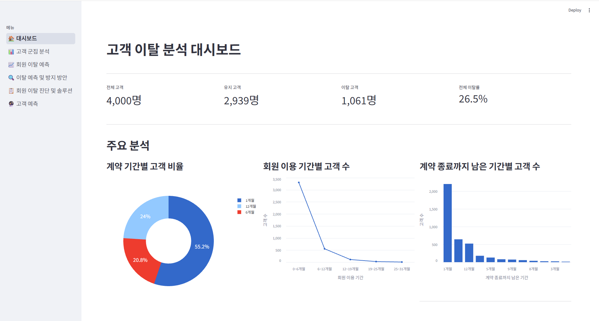
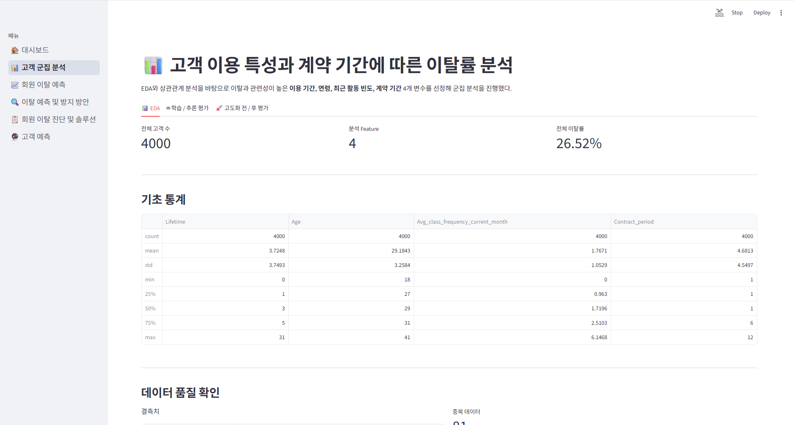
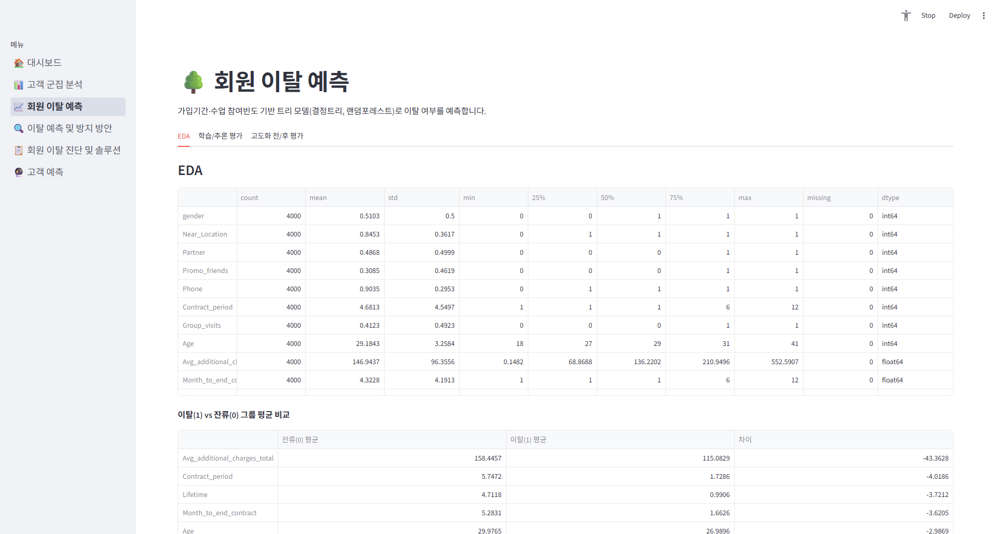
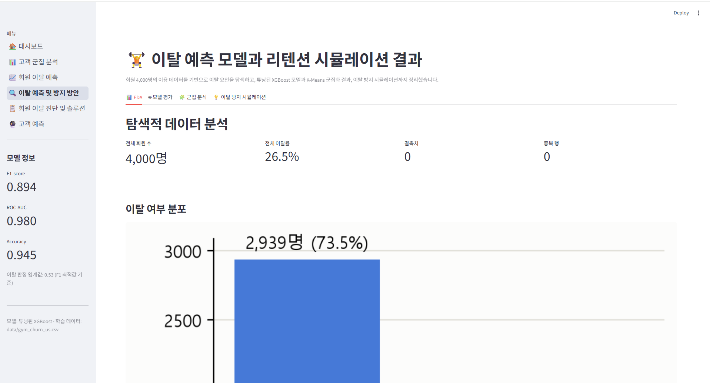
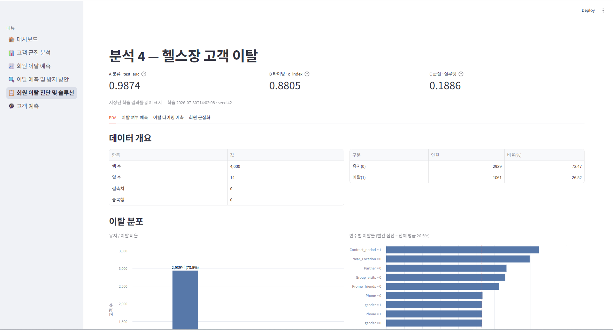
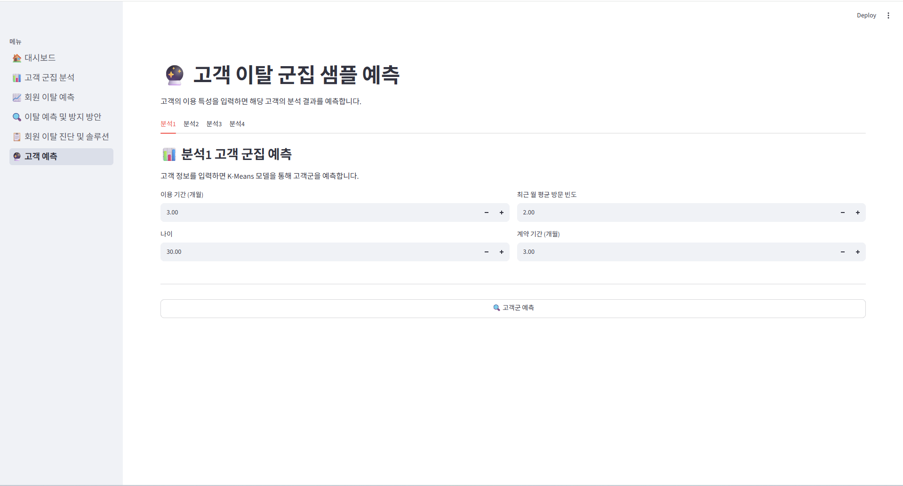

# 🤖 AI 기반 고객 이탈 분석 프로젝트

## 📑 목차 
1. [🤝 팀 소개](#1--팀-소개-)
2. [🔎 프로젝트 개요](#2--프로젝트-개요-)
3. [📅 프로젝트 진행 일정](#3--프로젝트-진행-일정-)
4. [🔧 기술 스택](#4--기술-스택-)
5. [📁 프로젝트 구조](#5--프로젝트-구조-)
6. [🚀 실행 방법](#6--실행-방법-)
7. [📊 데이터 전처리 결과](#7--데이터-전처리-결과-)
8. [🧠 인공지능 학습 결과](#8--인공지능-학습-결과-)
9. [💾 학습된 인공지능 모델](#9--학습된-인공지능-모델-)
10. [💡 고객 이탈 방지 전략](#10--고객-이탈-방지-전략-)
11. [💻 서비스 주요 기능](#11--서비스-주요-기능-)
12. [❗ 트러블슈팅](#12--트러블슈팅-)
13. [💬 한줄 회고](#13--한줄-회고-)

## 1. 🤝 팀 소개 <a href="#-목차"><sub>🔝</sub></a>
 ### ✨ 팀 명: ???

| 이름 | 담당 |
|---|---|
| 이현준 | Streamlit UI 구현 · 군집 분석 |
| 정예린 | 데이터 수집 · 분류 모델 분석 |
| 김재현 | 분류 모델 · 군집 분석 |
| 김태윤 | 회귀 · 분류 · 군집 분석 |

## 2. 🔎 프로젝트 개요 <a href="#-목차"><sub>🔝</sub></a>
### 프로젝트명
**💪 헬스장 고객 이용 특성 기반 이탈 분석 및 고객군 예측 시스템**

### 프로젝트 소개
헬스장 고객의 **이용 기간, 연령, 방문 빈도, 계약 기간 등의 데이터를 분석**하여 고객의 이용 특성을 파악하고, 고객군을 군집화하여 **고객군별 이탈률과 이탈 특성**을 분석하는 프로젝트입니다.

또한 분류·회귀·군집 분석을 활용하여 고객 데이터를 다양한 관점에서 분석하고, 분석 결과를 **Streamlit**으로 시각화하여 고객 이탈 현황과 특성을 쉽게 확인할 수 있도록 구현했습니다.

### 프로젝트 필요성
일반적으로 헬스장 회원의 이탈 원인은 단순히 **운동에 대한 흥미가 떨어지거나 운동을 하기 싫어서**라고 생각하기 쉽습니다.

하지만 실제로는 운동을 꾸준히 하는 고객이나 이용 빈도가 높은 고객도 계약을 종료하거나 이탈할 수 있습니다. 따라서 단순한 이용 빈도만으로는 고객 이탈의 원인을 충분히 설명하기 어렵습니다.

이에 고객의 **이용 기간, 연령, 방문 빈도, 계약 기간 등 다양한 특성**을 종합적으로 분석하여 어떤 고객군에서 이탈이 많이 발생하는지 파악하고, 고객 이탈에 영향을 미치는 패턴을 찾아볼 필요가 있습니다.

### 프로젝트 목표
* 고객 데이터를 기반으로 **주요 이용 특성과 이탈 패턴 파악**
* 고객 특성에 따른 **고객군 분류 및 군집별 특성 분석**
* 고객군별 **이탈률을 비교하여 이탈 위험이 높은 고객군 파악**
* 분류·회귀·군집 분석을 활용한 **다각적인 고객 분석**
* 분석 결과를 Streamlit으로 구현하여 **직관적인 데이터 분석 환경 제공**
* 분석 및 모델 고도화를 통해 **고객 이탈 관리에 활용할 수 있는 인사이트 도출**

## 3. 📅 프로젝트 진행 일정 <a href="#-목차"><sub>🔝</sub></a>

| 기간              | 주요 작업                   |
| --------------- | ----------------------- |
| **7/21 ~ 7/24** | 데이터 수집                  |
| **7/25 ~ 7/26** | 아키텍처 설계 · UI 설계 및 구현    |
| **7/27 ~ 7/29** | 데이터 분석                  |
| **7/30 ~ 8/1**  | 모델 학습 및 고도화 · 개별 페이지 구현 |
| **8/2**         | 예측 페이지 구현               |
| **8/3**         | 개별 분석 레포트 작성            |
| **8/4**         | 최종 분석 레포트 작성               |
| **8/5**         | 프로젝트 README 작성 · 최종 점검  |
| **8/6**         | 프로젝트 발표              |

## 4. 🔧 기술 스택 <a href="#-목차"><sub>🔝</sub></a>

| 구분 | 기술 |
| ------------ | ------------|
| **언어** |  |
| **데이터 분석** |   |
| **머신러닝** |    |
| **시각화** |     |
| **웹 애플리케이션** |  |
| **협업** |   |

## 5. 📁 프로젝트 구조 <a href="#-목차"><sub>🔝</sub></a>

```text
project_2nd/
├─ .streamlit/              # Streamlit 환경 및 화면 설정
├─ data/                    # 분석에 사용되는 원본 데이터
├─ docs/                    # 프로젝트 문서 자료
│
├─ models/                  # 학습된 모델 및 예측에 필요한 파일
│  ├─ analysis1/            
│  ├─ analysis2/            
│  ├─ analysis3/           
│  └─ analysis4/            
│
├─ notebooks/               # 분석 및 모델링 과정의 Jupyter Notebook
│  ├─ analysis1.ipynb
│  ├─ analysis2.ipynb
│  ├─ analysis3.ipynb
│  └─ analysis4.ipynb
│
├─ pages/                   # Streamlit 페이지
│  ├─ dashboard.py          # 전체 분석 결과 대시보드
│  ├─ analysis1~4.py        # 팀원별 분석 결과 페이지
│  └─ predict.py            # 샘플 데이터 예측 페이지
│
├─ reports/                 # 분석 및 프로젝트 결과 보고서
│  ├─ images/               # 분석별 시각화 결과 이미지
│  │  ├─ analysis1~4/       # 각 분석별 그래프 및 결과 이미지
│  ├─ analysis1~4_report.md # 팀원별 분석 보고서
│  └─ final_report.md       # 최종 프로젝트 보고서
│
├─ src/                     # 데이터 분석 및 모델링 코드
│  ├─ analysis1~4/          # 분석별 EDA·전처리·학습·평가·예측 모듈
│  └─ common/               # 공통 데이터 로딩 및 설정
│
├─ app.py                   # Streamlit 실행 및 페이지 구성
├─ README.md                # 프로젝트 소개 및 문서
├─ requirements.txt         # 프로젝트 의존성 패키지
└─ .gitignore               # Git 관리 제외 파일 설정
```

## 6. 🚀 실행 방법 <a href="#-목차"><sub>🔝</sub></a>
### 1. 권장 (uv + pyproject.toml)
```bash
# uv 설치 (최초 1회)
pip install uv

# 의존성 설치 및 가상환경 생성
uv sync

# Streamlit 실행
uv run streamlit run app.py
```

### 2. uv + requirements.txt
```bash
# uv 설치 (최초 1회)
pip install uv

# 가상환경 생성
uv venv

# 의존성 설치
uv pip install -r requirements.txt

# Streamlit 실행
uv run streamlit run app.py
```

### 3. Python venv + requirements.txt
```bash
# 가상환경 생성
python -m venv .venv

# 가상환경 활성화
.venv\Scripts\activate      # Windows
source .venv/bin/activate   # macOS / Linux

# 의존성 설치
pip install -r requirements.txt

# Streamlit 실행
streamlit run app.py
```

## 7. 📊 데이터 전처리 결과 <a href="#-목차"><sub>🔝</sub></a>
[개별 레포트 링크](./reports/)

## 8. 🧠 인공지능 학습 결과 <a href="#-목차"><sub>🔝</sub></a>
[개별 레포트 링크](./reports/)

## 9. 💾 학습된 인공지능 모델 <a href="#-목차"><sub>🔝</sub></a>
[개별 레포트 링크](./reports/)

## 10. 💡 고객 이탈 방지 전략 <a href="#-목차"><sub>🔝</sub></a>
### 🏠 개인 헬스장
1:1 밀착 관리: 신규 회원 운동 루틴·목표 설정·트레이너 상담 강화  
출석 관리: 방문 감소 회원에게 개인 연락 및 PT 체험 제공  
추천 마케팅: 친구 추천 시 이용기간 연장·PT 등 혜택 제공  

### 🏢 체인 헬스장
콜라보 마케팅: 연예인·인플루언서·유튜버와 협업하여 한정판 굿즈 제공  
프로모션: 장기 계약·고빈도 방문 회원 대상 할인 및 굿즈 제공  
제휴 확대: 기업·지역 제휴 및 추천 프로그램을 통한 신규 회원 유입  

### 🤝 공통 대책
신규 회원 관리: 가입 초기 1~3개월 집중 초기 관리 및 목표 설정  
방문 감소 관리: 알림·쿠폰·상담·이벤트를 통한 재방문 유도  
장기 계약 유도: 단기 계약 회원에게 장기 계약 할인 및 혜택 제공  
그룹수업 활성화: 미참여 회원 대상 무료 체험 및 참여 혜택 제공  
복귀 회원 혜택: 일정 기간 이용하지 않은 기존 회원의 재방문을 유도하기 위한 혜택 제공

## 11. 💻 서비스 주요 기능 <a href="#-목차"><sub>🔝</sub></a>
### 대시보드


### 고객 군집 분석


### 회원 이탈 예측


### 이탈 예측 및 방지 방안


### 회원 이탈 진단 및 솔루션


### 고객 예측


## 12. ❗ 트러블슈팅 <a href="#-목차"><sub>🔝</sub></a>
### 이현준
고도화 과정에서 만들어 놓은 고도화 전처리를 사용안하고 고도화 전에 했던 전처리를 사용해서
고도화를 진행해 계속 같은 값만 나와서 해매다가 결국 원인을 찾아서 정상적으로 고도화를
적용 했다.

### 정예린
여러 가상환경을 오가며 작업하다 모듈 에러가 발생해, 올바른 가상환경 확인 후 재설치했다.

### 김재현
깃허브 공동작업에 대한 숙련도 부족 문제로 저장소 연결에 문제가 있었지만 검색 등을 통해 문제를 해결했다.

### 김태윤
기획 단계에서 작업 내용과 관련해 팀과 의견 차이가 있었으나 팀의 의견을 수용하였다.

## 13. 💬 한줄 회고 <a href="#-목차"><sub>🔝</sub></a>
### 이현준
어떨결에 팀장을 하게 됐다. 현업에 있을때 팀장님 밑에서 일만 해봤지 직접 해본 적이 없어서
어떻게 해야 할지 고민이 많았지만 그래도 나름 최선을 다해서 팀을 이끌도록 노력했다.
그리고 경력자로써 프로젝트 경험은 많지만 전부 기능개발, 서비스 제공 프로젝트들이 였고
개발 기간도 긴 프로젝트들만 했었다 보니 이런 분석 관련 과 짧은 기간에 해야하는
상황에서는 경험이 없어 프로젝트 규모를 작게해서 진행했다. 그래서 팀원들 만족도를 충족 시키지 못한 아쉬운이 있다. 

### 정예린
각자의 역할분담이 잘 나눠져 큰 문제 없이 프로젝트를 수행했지만, 아이디어를 좀 더 구체화했다면 다양하고 좋은 결과가 나왔을 것 같다.

### 김재현
머신러닝에 대해 전체적으로 복습할 수 있어서 좋았다. 기능이 좀 더 다양했다면 어땠을까 하는 아쉬움이 남는다.

### 김태윤
더 다양하고 많은 작업이 가능했을 것 같은데 안 해서 아쉽지만 편하긴 했다.