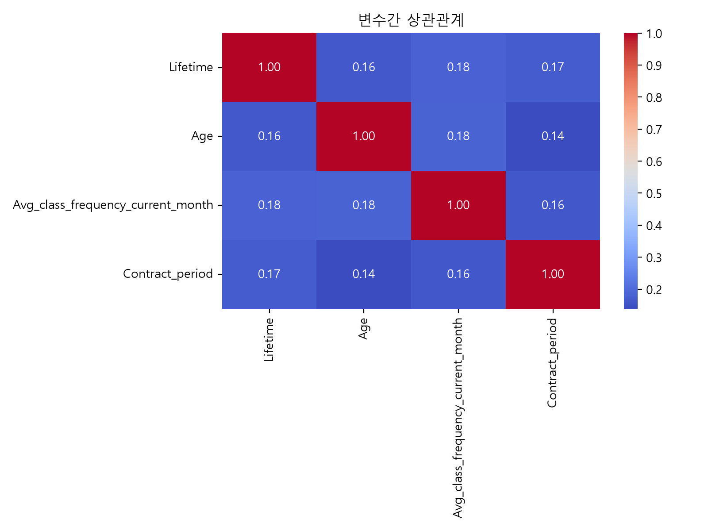

# 고객 이탈 위험 분석 레포트

## 1. 분석 목적
이 레포트는 헬스장 고객 데이터를 기반으로 고객 군집을 분석하고, 각 군집의 특성과 이탈 위험도를 파악하기 위한 내용을 정리한 문서이다. 특히 이용 기간, 나이, 월 평균 방문 빈도, 계약 기간 등의 변수를 중심으로 고객을 분류하고, 이탈 가능성이 높은 고객군을 식별하는 데 초점을 두었다.

## 2. 데이터 개요
분석에 사용한 데이터는 4,000명의 고객 정보이며, 총 14개의 컬럼으로 구성되어 있다. 결측치는 없는 것으로 확인되었고, 중복 데이터도 없었다. 이탈률은 약 26.52%로 나타났다.

### 분석에 사용한 주요 변수
- Lifetime: 헬스장 이용 기간
- Age: 고객 나이
- Avg_class_frequency_current_month: 최근 한 달 평균 방문 빈도
- Contract_period: 계약 기간
- Churn: 이탈 여부

## 3. 탐색적 데이터 분석(EDA)
### 3.1 변수 분포
고객 특성을 확인하기 위해 주요 변수의 분포를 시각화하였다.

분석 결과는 다음과 같다.
- Lifetime은 오른쪽으로 긴 꼬리를 가진 분포를 보여, 일부 고객이 매우 긴 이용 기간을 가진 것으로 나타났다.
- Age는 비교적 안정적인 분포를 보였다.
- Avg_class_frequency_current_month는 일부 고객이 비교적 높은 방문 빈도를 보였으나, 대체로 낮은 수준의 이용 빈도를 가진 고객이 많았다.
- Contract_period는 짧은 계약 기간에 몰린 경향이 있었다.

### 3.2 변수 간 상관관계
변수 간 관계를 확인한 결과, 전반적으로 상관관계는 낮은 수준으로 나타났다.

이 결과는 군집 분석에서 각 변수가 서로 독립적으로 중요한 정보를 담고 있을 가능성을 시사한다.

## 4. 데이터 분리 및 전처리
학습/평가 데이터 분리를 위해 80:20 비율로 분할하였으며, 클래스 불균형을 반영하기 위해 Stratify을 적용하였다. 전처리 단계에서는 StandardScaler를 사용해 변수의 스케일 차이를 조정한 뒤, K-Means 군집 모델을 적용하였다.

## 5. 기본 군집 모델 분석
### 5.1 최적 군집 수 선정
K값을 2부터 10까지 변화시키며 군집 성능을 평가하였다.

분석 결과, Elbow Method는 4부터 완만해지는 경향을 보였고, Silhouette Score는 4에서 가장 높은 값을 나타내었다. 따라서 기본 모델의 최적 군집 수는 4로 선정하였다.

### 5.2 모델 평가 결과
기본 모델의 학습 및 평가 데이터 실루엣 점수를 비교한 결과는 아래와 같다.

- Train Silhouette Score: 0.2673
- Test Silhouette Score: 0.2669

두 점수가 유사하게 나타나므로 과적합의 우려는 낮은 편으로 판단되었다.

### 5.3 군집별 특성 비교
각 군집의 평균 특성을 확인한 결과, 군집별로 뚜렷한 특징이 발견되었다.

- 0번 클러스터: 이용 기간이 짧고, 계약 기간도 짧은 편으로 보아 단기계약 회원으로 해석되었다.
- 1번 클러스터: 이용 기간과 계약 기간이 상대적으로 긴 편으로 장기 계약 회원에 가깝다.
- 2번 클러스터: 이용 기간이 길고, 비교적 고급/우수 이용 회원으로 해석되었다.
- 3번 클러스터: 이용 기간과 방문 빈도가 낮고, 이탈 가능성이 높은 회원으로 해석되었다.

### 5.4 군집별 이탈률 분석
각 군집의 이탈률을 비교한 결과, 3번 클러스터가 가장 높은 이탈률을 보였다.

이 결과는 3번 군집이 실제로 이탈 위험 고객군에 해당할 가능성이 높다는 점을 시사한다.

### 5.5 PCA 시각화 결과
PCA를 이용해 군집 분포를 2차원으로 시각화하였다.

대부분의 군집이 비교적 분명하게 구분되었지만, 일부 군집은 분산이 넓어 다양한 고객 특성이 섞여 있음을 보여주었다.

## 6. 모델 고도화 분석
### 6.1 RobustScaler 적용
기본 모델의 민감도를 줄이기 위해 RobustScaler를 적용한 고도화 모델을 추가로 검증하였다. 해당 모델은 이상치에 덜 민감하게 반응하면서 보다 안정적인 군집 구조를 형성할 수 있다.

고도화 모델에서는 최적 군집 수가 3으로 측정되었다. 이 결과는 기본 모델보다 더 단순하고 명확한 군집 구조를 제공할 수 있음을 보여준다.

### 6.2 고도화 모델의 군집 해석
고도화 모델의 군집별 평균 특성을 확인한 결과는 다음과 같다.

- 0번 클러스터: 이용 기간이 긴 편으로 VIP 회원군으로 해석되었다.
- 1번 클러스터: 계약 기간이 긴 편으로 장기 계약 회원군으로 해석되었다.
- 2번 클러스터: 이용 기간과 방문 빈도 모두 낮아 이탈 위험 고객군으로 해석되었다.

### 6.3 고도화 모델의 이탈률 분석
고도화 모델에서도 2번 클러스터가 가장 높은 이탈률을 보였다.

### 6.4 고도화 모델의 PCA 시각화
고도화 모델의 분포 또한 비교적 명확하게 군집 구조를 보여주었다.

### 6.5 고도화 모델 성능
고도화 모델의 실루엣 점수는 다음과 같았다.
- Train Silhouette Score: 0.3077
- Test Silhouette Score: 0.3130

기본 모델 대비 더 높은 군집 성능을 보였으며, 고객 군집의 해석 가능성도 향상되었다.

## 7. 결론
이번 분석을 통해 고객을 군집화하여 이탈 위험이 높은 고객군을 식별할 수 있었다. 특히 짧은 이용 기간과 낮은 방문 빈도를 가진 고객군이 이탈 가능성이 높았으며, RobustScaler를 적용한 고도화 모델이 더 안정적이고 해석 가능한 군집 결과를 제공하였다. 향후에는 이 결과를 바탕으로 이탈 위험 고객에게 맞춤형 할인, 재방문 유도, 계약 연장 제안 등 리텐션 전략을 설계하는 데 활용할 수 있다.

## 8. 요약
- 고객 데이터에서 이탈 위험이 높은 군집을 식별할 수 있었다.
- 기본 모델과 고도화 모델 모두 이탈 위험이 높은 클러스터를 확인할 수 있었고, 고도화 모델이 더 좋은 군집 성능을 보였다.
- 핵심 특징은 짧은 이용 기간, 낮은 방문 빈도, 짧은 계약 기간으로 나타났다.
- 이 결과는 향후 고객 유지 전략 수립에 직접적으로 활용할 수 있다.