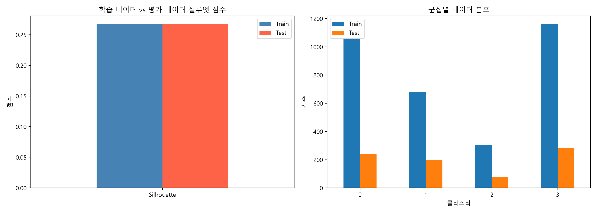
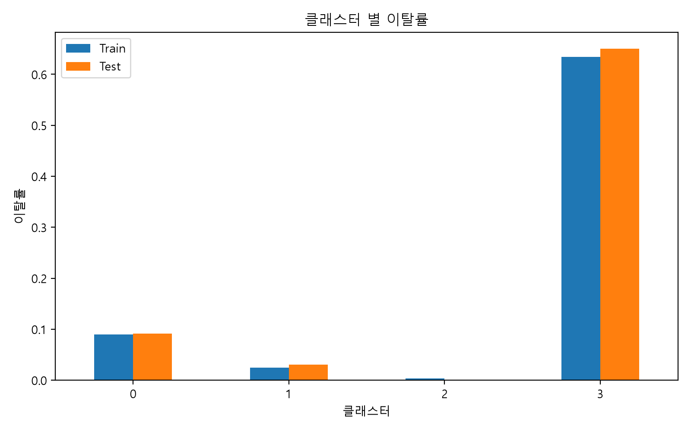
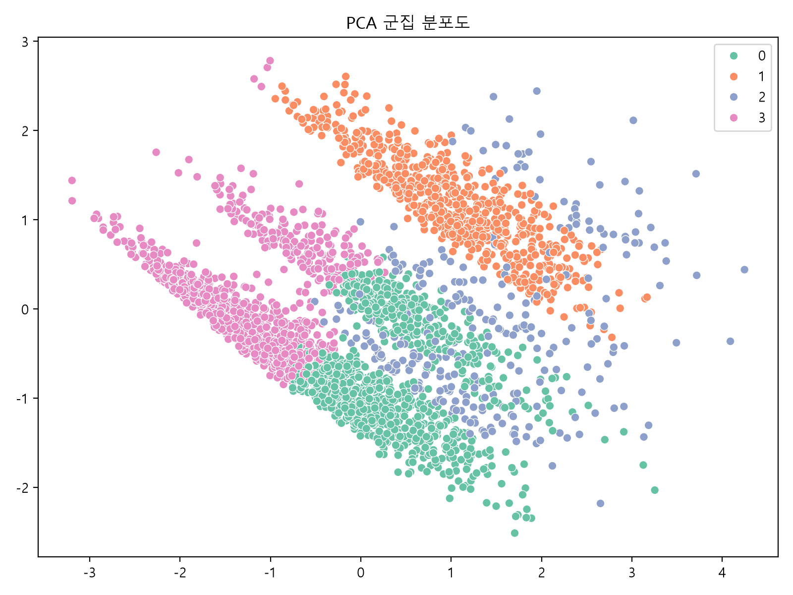
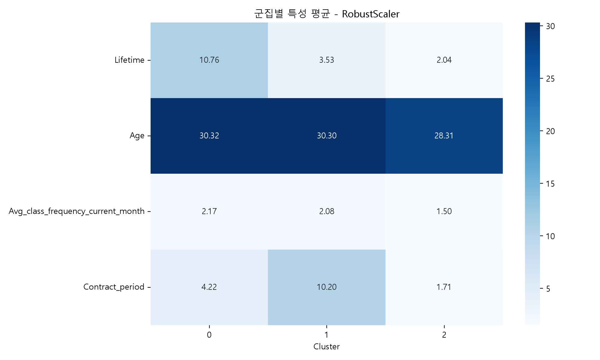
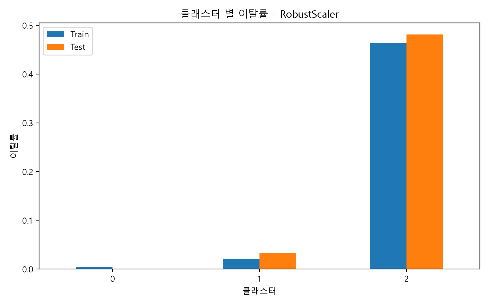

# 고객 이탈 위험 분석 레포트

## 1. 분석 목적

이 레포트는 헬스장 고객 데이터를 기반으로 고객 군집을 분석하고, 각 군집의 특성과 이탈 위험도를 파악하기 위한 내용을 정리한 문서이다.

특히 **이용 기간, 나이, 월 평균 방문 빈도, 계약 기간** 등의 변수를 중심으로 고객을 군집화하고, 이탈 가능성이 높은 고객군을 식별하는 데 초점을 두었다.

---

## 2. 데이터 개요

분석에 사용한 데이터는 **4,000명의 고객 정보와 14개의 컬럼**으로 구성되어 있다.

데이터 기본 정보를 확인한 결과, **결측치는 없었으며 중복 데이터도 존재하지 않았다.** 전체 고객의 이탈률은 약 **26.52%**로 나타났다.

### 분석에 사용한 주요 변수

| 변수                                  | 설명                          |
| ----------------------------------- | --------------------------- |
| `Lifetime`                          | 헬스장 이용 기간(개월)               |
| `Age`                               | 고객의 나이                      |
| `Avg_class_frequency_current_month` | 최근 한 달 평균 방문 빈도             |
| `Contract_period`                   | 계약 기간                       |
| `Churn`                             | 고객 이탈 여부 (`0`: 유지, `1`: 이탈) |

---

# 3. 인공지능 데이터 전처리 결과서

## 3.1 데이터 기본 정보 확인

원본 데이터를 불러온 후 데이터의 구조와 통계 정보를 확인하였다.

* 전체 고객 수: 4,000명
* 전체 변수 수: 14개
* 결측치: 없음
* 중복 데이터: 없음
* 이탈률: 약 26.52%

## 3.2 분석 변수 선정

고객 군집 분석에 사용할 변수를 다음과 같이 선정하였다.

* `Lifetime`
* `Age`
* `Avg_class_frequency_current_month`
* `Contract_period`

이탈 여부를 나타내는 `Churn`은 군집 생성에는 직접 사용하지 않고, **생성된 군집별 이탈률을 비교하기 위한 평가 변수**로 활용하였다.

## 3.3 데이터 분리

전체 데이터를 학습 데이터와 평가 데이터로 **80:20 비율**로 분리하였다.

이때 `stratify=y`를 적용하여 학습 데이터와 평가 데이터의 **이탈/유지 고객 비율이 원본 데이터와 유사하게 유지되도록 구성**하였다.

## 3.4 데이터 스케일링

K-Means는 변수의 거리 차이를 기반으로 군집을 형성하기 때문에 변수별 스케일 차이의 영향을 줄이기 위해 `StandardScaler`를 적용하였다.

전처리와 K-Means를 하나의 Pipeline으로 구성하여 동일한 전처리 과정이 학습과 추론에 적용되도록 하였다.

---

# 4. 인공지능 학습 결과서

## 4.1 기본 모델 학습

기본 모델은 다음과 같이 구성하였다.

**StandardScaler → K-Means**

K-Means의 군집 수를 결정하기 위해 `K=2~10` 범위에서 Elbow Method와 Silhouette Score를 비교하였다.

## 4.2 최적 군집 수 선정


분석 결과, Elbow Method는 **K=4부터 완만해지는 경향**을 보였으며 Silhouette Score는 **K=4에서 가장 높은 값**을 나타냈다.

따라서 기본 모델의 최적 군집 수는 **K=4**로 선정하였다.

## 4.3 기본 모델 평가



* Train Silhouette Score: **0.2673**
* Test Silhouette Score: **0.2669**

Train과 Test의 실루엣 점수가 유사하게 나타나 **학습 데이터와 평가 데이터에서 군집 구조가 비교적 안정적으로 유지되는 것**을 확인하였다.

## 4.4 군집별 고객 특성


군집별 평균 특성을 비교한 결과 다음과 같이 해석할 수 있었다.

* **0번 클러스터**: 이용 기간과 계약 기간이 짧은 **단기계약 회원군**
* **1번 클러스터**: 이용 기간과 계약 기간이 상대적으로 긴 **장기 계약 회원군**
* **2번 클러스터**: 이용 기간이 길고 이용 특성이 상대적으로 안정적인 **우수 이용 회원군**
* **3번 클러스터**: 이용 기간과 방문 빈도가 낮은 **이탈 위험 회원군**

## 4.5 군집별 이탈률



군집별 이탈률을 비교한 결과 **3번 클러스터의 이탈률이 가장 높게 나타났다.**

따라서 이용 기간과 방문 빈도가 낮은 고객군이 상대적으로 높은 이탈 위험을 가지고 있는 것으로 해석하였다.

## 4.6 PCA 군집 분포



PCA를 이용하여 고차원 데이터를 2차원으로 축소한 결과, 일부 군집은 비교적 구분되는 모습을 보였으나 일부 영역에서는 군집 간 분포가 겹치는 모습도 확인되었다.

---

# 5. 인공지능 모델 고도화 결과서

## 5.1 RobustScaler 적용

기본 모델의 전처리 방식인 `StandardScaler` 대신 이상치의 영향을 상대적으로 줄일 수 있는 `RobustScaler`를 적용하여 고도화 모델을 구성하였다.

고도화 모델은 다음과 같이 구성하였다.

**RobustScaler → K-Means**

## 5.2 고도화 모델 최적 군집 수


고도화 모델에서 `K=2~10`을 비교한 결과, 기본 모델과 달리 **최적 군집 수가 K=3으로 선정**되었다.

## 5.3 고도화 모델 군집 특성



고도화 모델의 군집별 특성은 다음과 같이 해석하였다.

* **0번 클러스터**: 이용 기간이 긴 **VIP 회원군**
* **1번 클러스터**: 계약 기간이 긴 **장기 계약 회원군**
* **2번 클러스터**: 이용 기간과 방문 빈도가 낮은 **이탈 위험 회원군**

## 5.4 고도화 모델 이탈률



고도화 모델에서도 **2번 클러스터의 이탈률이 가장 높게 나타났다.**

따라서 전처리 방식을 변경한 이후에도 **이용 기간과 방문 빈도가 낮은 고객군이 높은 이탈 위험을 보이는 패턴이 유지되는 것**을 확인하였다.

## 5.5 고도화 모델 PCA 분포


고도화 모델에서도 군집별 분포가 확인되었으며, 일부 군집은 비교적 명확한 특성을 보였다.

## 5.6 고도화 모델 성능 비교

고도화 모델의 실루엣 점수는 다음과 같다.

* Train Silhouette Score: **0.3077**
* Test Silhouette Score: **0.3130**

기본 모델의 Test Silhouette Score **0.2669**와 비교하면 고도화 모델의 Test Silhouette Score가 **0.3130으로 향상**되었다.

따라서 `RobustScaler`를 적용한 고도화 모델이 기존 `StandardScaler` 기반 모델보다 더 높은 군집 품질을 보이는 것을 확인하였다.

---

# 6. 학습된 인공지능 모델

## 6.1 사용 모델

본 분석에서는 고객 특성을 기반으로 군집을 생성하기 위해 **K-Means Clustering**을 사용하였다.

| 구분              | 기본 모델          | 고도화 모델       |
| --------------- | -------------- | ------------ |
| 전처리             | StandardScaler | RobustScaler |
| 모델              | K-Means        | K-Means      |
| 최적 K            | 4              | 3            |
| Test Silhouette | 0.2669         | **0.3130**   |

## 6.2 모델 저장

최종적으로 학습된 군집 모델은 `joblib` 형식으로 저장하여 이후 Streamlit 예측 페이지에서 재사용할 수 있도록 구성하였다.

```text
models/
└─ analysis1/
   └─ churn_cluster_model.joblib
```

저장된 모델은 고객의 주요 특성값을 입력받아 해당 고객이 어느 군집에 속하는지 예측하는 데 활용할 수 있다.

---

# 7. 결론

이번 분석을 통해 고객의 **이용 기간, 나이, 최근 방문 빈도, 계약 기간**을 기반으로 고객군을 분류하고, 각 군집의 이탈 위험을 비교할 수 있었다.

기본 모델에서는 **3번 클러스터**, 고도화 모델에서는 **2번 클러스터**가 가장 높은 이탈률을 보였다.

특히 **짧은 이용 기간과 낮은 방문 빈도**를 가진 고객군에서 이탈 위험이 높게 나타났으며, `RobustScaler`를 적용한 고도화 모델은 기존 모델보다 높은 Silhouette Score를 기록하였다.

이러한 분석 결과는 이탈 위험 고객을 사전에 식별하고, 향후 **맞춤형 할인, 재방문 유도, 계약 연장 제안 등의 고객 유지 전략**을 수립하는 데 활용할 수 있다.

---

# 8. 요약

* 고객 데이터의 결측치와 중복 데이터를 확인한 결과 문제가 없었다.
* `Lifetime`, `Age`, `Avg_class_frequency_current_month`, `Contract_period`를 주요 군집 분석 변수로 선정하였다.
* 기본 K-Means 모델의 최적 군집 수는 **K=4**였다.
* 고도화 모델의 최적 군집 수는 **K=3**이었다.
* 고도화 모델의 Test Silhouette Score는 **0.3130**으로 기본 모델의 **0.2669**보다 향상되었다.
* 이용 기간과 방문 빈도가 낮은 고객군에서 높은 이탈 위험이 확인되었다.
* 저장된 모델은 향후 고객 샘플 데이터를 입력받아 이탈 위험군을 예측하는 데 활용할 수 있다.

# 9. 이탈 방지 대책
요즘 추세에 맞게 인플루언서, 스트리머, 유튜버 들과 콜라보 기획을 세워서
특정 기간 이상으로 계약을 한 고객, 한달 간 특정 이상의 횟수를 방문한 고객에게 **한정판 굿즈**를 제공해 장기 계약, 잦은 방문을 유도한다.