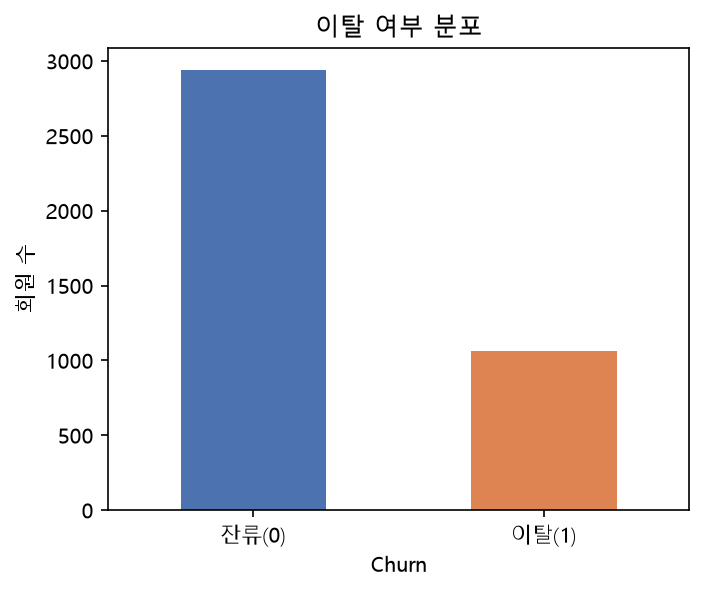
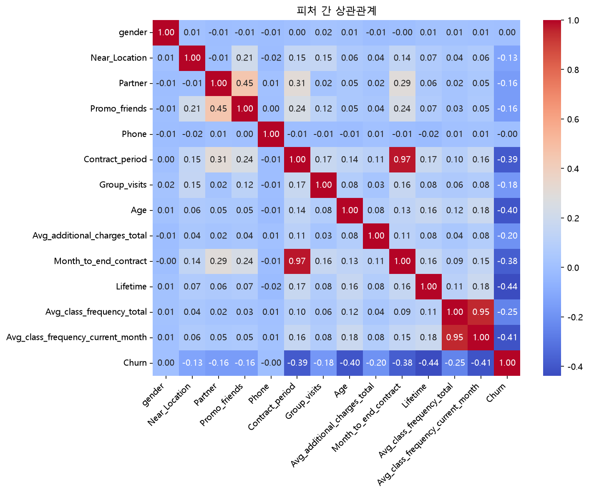
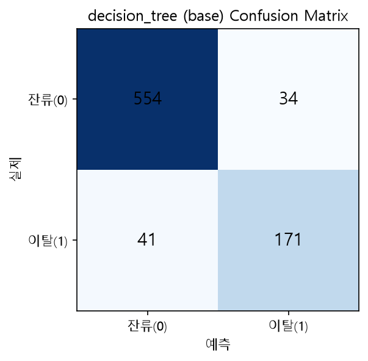
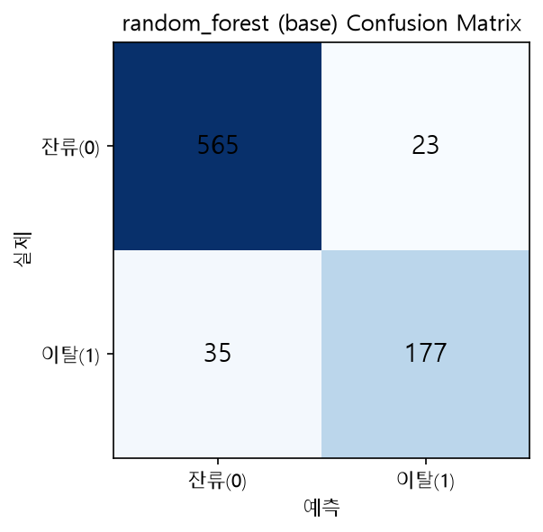
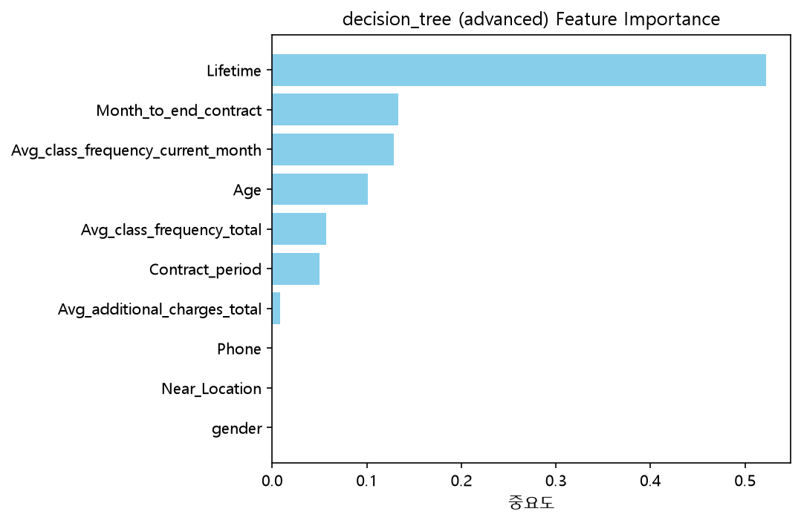
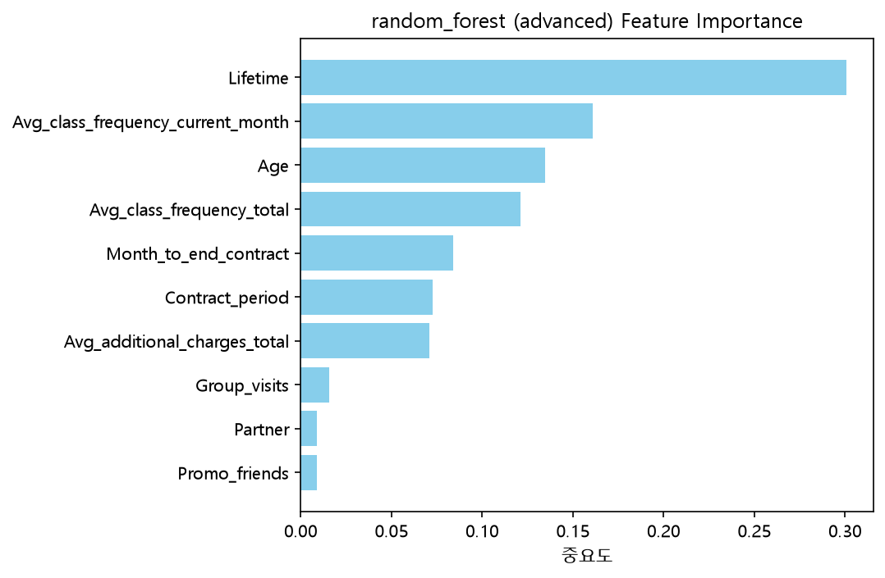

# 회원 이탈 예측

**담당 역할**: 데이터 수집 · 분류 모델 분석 (결정트리 / 랜덤포레스트)

## 1. 분석 목적

헬스장 회원 이탈 예측 문제에 트리 기반 모델(결정트리, 랜덤포레스트)을 적용하여
- 회원의 인구통계 및 이용 행동 데이터로부터 이탈 여부를 예측하고
- 하이퍼파라미터 튜닝을 통해 기본 모델 대비 성능을 개선하며
- Feature Importance를 통해 이탈에 가장 크게 영향을 미치는 요인을 파악하여
비즈니스 관점에서 리텐션 전략 수립에 활용 가능한 인사이트를 도출하는 것을 목표로 한다.

---

## 2. 인공지능 데이터 전처리 결과서

### 2.1 데이터 개요
- 데이터: `gym_churn_us.csv`, 4,000명 회원, 14개 컬럼 (수치형 13개 + 타겟 `Churn`)
- 결측치 0건, 중복행 0건 — 전처리 부담이 적은 데이터
- 모든 피처가 이미 숫자형(0/1 인코딩 포함)으로 되어 있어 별도 인코딩 작업 불필요
- 전체 이탈률: **26.5%** (전체 4,000명 중 이탈 1,061명, 잔류 2,939명)

### 2.2 탐색적 데이터 분석(EDA) 및 주요 인사이트

- 이탈(1) vs 잔류(0) 그룹 평균 비교 결과 (차이가 큰 순):

| 피처 | 잔류(0) 평균 | 이탈(1) 평균 | 차이 |
|---|---|---|---|
| Avg_additional_charges_total | 158.45 | 115.08 | -43.36 |
| Contract_period | 5.75 | 1.73 | -4.02 |
| Lifetime | 4.71 | 0.99 | -3.72 |
| Month_to_end_contract | 5.28 | 1.66 | -3.62 |
| Age | 29.98 | 26.99 | -2.99 |

  → 이탈 회원은 잔류 회원 대비 계약기간(Contract_period), 가입기간(Lifetime), 계약 종료까지 남은 개월(Month_to_end_contract)이 모두 뚜렷하게 짧고, 부가서비스 지출(Avg_additional_charges_total)도 낮음. 즉 **"짧은 계약 + 낮은 지출 + 낮은 참여"가 이탈의 전형적 패턴**으로 나타남

- Churn과의 상관계수 (절댓값 기준 상위):

| 피처 | 상관계수 |
|---|---|
| Lifetime | -0.44 |
| Avg_class_frequency_current_month | -0.41 |
| Age | -0.40 |
| Contract_period | -0.39 |
| Month_to_end_contract | -0.38 |

### 2.3 다중공선성 처리
- `Contract_period`와 `Month_to_end_contract`의 상관계수가 **0.97**로 매우 높음 (계약기간이 길수록 남은 기간도 자연히 길어지는 구조적 관계)
- `Avg_class_frequency_total`과 `Avg_class_frequency_current_month`의 상관계수도 **0.95**로 매우 높음
- 두 쌍 모두 강한 다중공선성이 확인되나, 트리 기반 모델(결정트리/랜덤포레스트)은 다중공선성에 상대적으로 강건하여 별도 피처 제거는 진행하지 않음

### 2.4 데이터 분리
- 전체 컬럼이 이미 숫자형이라 별도 인코딩 없이 X(피처), y(타겟) 분리
- Train/Test = 8:2 비율로 분할, `stratify=y`로 이탈 비율(26.5%) Train/Test 동일하게 유지

---

## 3. 인공지능 학습 결과서

### 3.1 사용 모델
| 모델 | 설명 |
|---|---|
| 결정트리 (Decision Tree) | 기본 파라미터, `random_state=42` |
| 랜덤포레스트 (Random Forest) | 기본 파라미터, `random_state=42` |

### 3.2 Train/Test 성능 (고도화 전)

| 모델 | Accuracy | Precision | Recall | F1 | ROC-AUC |
|---|---|---|---|---|---|
| Decision Tree | 0.9062 | 0.8341 | 0.8066 | 0.8201 | 0.8744 |
| Random Forest | 0.9275 | 0.8850 | 0.8349 | 0.8592 | 0.9676 |

- Decision Tree: 실제 이탈자 212명 중 41명을 잔류로 잘못 예측 (FN 비율 약 19.3%)
- Random Forest: 실제 이탈자 212명 중 35명을 잔류로 잘못 예측 (FN 비율 약 16.5%)
- 두 모델 다 이탈자를 잔류로 잘못 예측하는 비율(FN)이 낮아 이탈 감지 성능 자체는 양호. 랜덤포레스트가 FN이 더 적어 이탈자를 놓치지 않는 측면에서 우세

### 3.3 모델 고도화 (하이퍼파라미터 튜닝)

- GridSearchCV 사용, `scoring="recall"` 기준 (이탈자를 놓치지 않는 것이 비즈니스적으로 더 중요하다고 판단)
- 결정트리: `max_depth`, `min_samples_leaf` 탐색
- 랜덤포레스트: `n_estimators`, `max_depth`, `max_features` 탐색

| 모델 | Best Params |
|---|---|
| Decision Tree | `max_depth=5, min_samples_leaf=1` |
| Random Forest | `max_depth=10, max_features='sqrt', n_estimators=300` |

### 3.4 고도화 전/후 성능 비교

| 모델 | 구분 | Accuracy | Precision | Recall | F1 | ROC-AUC |
|---|---|---|---|---|---|---|
| Decision Tree | 고도화 전 | 0.9062 | 0.8341 | 0.8066 | 0.8201 | 0.8744 |
| Decision Tree | 고도화 후 | 0.9112 | 0.8439 | 0.8160 | 0.8297 | 0.9381 |
| Random Forest | 고도화 전 | 0.9275 | 0.8850 | 0.8349 | 0.8592 | 0.9676 |
| Random Forest | 고도화 후 | 0.9250 | 0.8878 | 0.8208 | 0.8529 | 0.9694 |

- 결정트리는 튜닝 후 5개 지표 모두 개선 (특히 ROC-AUC가 0.8744 → 0.9381로 크게 상승)
- 랜덤포레스트는 튜닝 후 ROC-AUC·Precision은 소폭 상승했지만 Accuracy·Recall·F1은 근소하게 하락 — 기본 모델이 이미 충분히 좋은 성능을 내고 있었음을 시사

### 3.5 Feature Importance (고도화 후 모델 기준)

- 두 모델 모두 **`Lifetime`(가입기간)**이 가장 큰 영향을 미치는 피처로 나타남 (중요도 압도적 1위)
- 다음으로 **`Avg_class_frequency_current_month`(최근 수업참여빈도)**, **`Age`(연령)** 순
- `gender`, `Near_Location`, `Phone` 등 인구통계·접근성 피처는 중요도가 낮게 나타나, 이탈 예측에는 인구통계보다 **실제 이용 행동 패턴**이 훨씬 중요하다는 인사이트

---

## 4. 학습된 인공지능 모델

`models/analysis2/` 폴더에 `joblib` 형식으로 저장, GitHub 업로드 완료

| 파일명 | 내용 |
|---|---|
| `decision_tree_base.pkl` | 결정트리 기본(튜닝 전) 모델 |
| `random_forest_base.pkl` | 랜덤포레스트 기본(튜닝 전) 모델 |
| `decision_tree_advanced.pkl` | 결정트리 튜닝 완료 모델 (`max_depth=5, min_samples_leaf=1`) |
| `random_forest_advanced.pkl` | 랜덤포레스트 튜닝 완료 모델 (`max_depth=10, max_features='sqrt', n_estimators=300`) — **최종 채택 모델** |
| `test_data.pkl` | 평가용 테스트셋 (X_test, y_test) — 재현성 확보를 위해 함께 저장 |

- 모델 로드 및 예측은 `src/analysis2/predict.py`에서 수행하며, Streamlit "예측" 페이지에서 4개 모델(기본/고도화 × 결정트리/랜덤포레스트) 중 선택하여 실시간 이탈 여부 예측 가능

---

## 5. 최종 결과 및 결론

- **최종 채택 모델: Random Forest (advanced)**
- 선정 근거: 고도화 전/후 모두 Accuracy(0.925~0.9275), Recall(0.82~0.8349), F1(0.8529~0.8592), ROC-AUC(0.9676~0.9694) 전 지표에서 결정트리보다 일관되게 우수. 특히 Recall이 높아 이탈 위험 회원을 놓치지 않는 비즈니스 목적에 더 부합
- 비즈니스 인사이트: 가입기간(Lifetime)이 짧고 최근 수업 참여빈도(Avg_class_frequency_current_month)가 낮은 회원일수록 이탈 위험이 높음. 이 두 지표를 기준으로 이탈 위험군을 조기에 선별하여, 가입 초반 회원 대상 온보딩 강화 및 수업 참여 빈도가 급감한 회원 대상 알림·할인 쿠폰 발송 등의 리텐션 전략을 제안할 수 있음
- 한계 및 개선 방향: 전체 데이터가 4,000건으로 규모가 크지 않고, 이탈률(26.5%)이 다소 불균형하여 향후 SMOTE 등 오버샘플링 기법 적용을 고려해볼 수 있음. 또한 XGBoost, 딥러닝 MLP 등 다른 모델과의 비교를 통해 추가적인 성능 개선 여지를 확인할 필요가 있음