# 분석 3 - 이탈 예측 모델과 리텐션 시뮬레이션 결과

## 1. 분석 목적
이 리포트는 피트니스 센터 회원 데이터를 기반으로 다음 달 이탈(탈퇴) 여부를 예측하는 머신러닝 모델을 구축하고, 그 과정에서 도출된 인사이트를 정리한 문서이다. 분석은 크게 세 축으로 진행되었다. 첫째, 회원의 인적 정보와 이용 패턴을 바탕으로 이탈 여부를 분류하는 지도학습 모델을 만드는 것이다. 둘째, K-Means 군집화를 통해 이용 패턴이 유사한 회원 세그먼트를 도출하고, 이 세그먼트 정보가 이탈 예측에 실제로 기여하는지를 검증하는 것이다. 셋째, 실제 이탈 회원의 계약·방문 관련 피처를 저이탈 세그먼트 수준으로 조정했을 때 예측 이탈확률이 얼마나 낮아지는지를 시뮬레이션하여, 분석 결과를 구체적인 리텐션 전략으로 연결하는 것이다.

## 2. 데이터 개요
분석에 사용한 데이터는 `data/gym_churn_us.csv`로, 회원 4,000명에 대한 14개 컬럼으로 구성되어 있다. 결측치와 중복 행은 확인되지 않았으며, 모든 컬럼이 이미 수치형으로 인코딩되어 있어 별도의 인코딩 작업 없이 분석이 가능하였다. 전체 이탈률은 26.53%(이탈 1,061명 / 잔존 2,939명)로, 클래스 간 어느 정도의 불균형은 있으나 두 클래스 모두 충분한 표본을 확보하고 있어 기본 모델 학습 단계에서는 별도의 리샘플링 없이 진행되었다.

### 분석에 사용한 주요 변수
- `gender`, `Near_Location`, `Partner`, `Promo_friends`, `Phone`, `Group_visits`: 성별, 거주지 인접 여부, 제휴사 소속 여부, 지인 추천 가입 여부, 연락처 등록 여부, 그룹 수업 참여 여부를 나타내는 이진 변수이다.
- `Age`: 회원의 나이이다.
- `Contract_period`: 계약 기간(개월)이다.
- `Month_to_end_contract`: 계약 만료까지 남은 개월 수이다.
- `Lifetime`: 가입 후 경과한 이용 개월 수이다.
- `Avg_class_frequency_total` / `Avg_class_frequency_current_month`: 전체 기간 평균 방문 빈도(주당)와 이번 달 평균 방문 빈도(주당)이다.
- `Avg_additional_charges_total`: 마사지, 카페 등 부가서비스의 평균 지출액이다.
- `Churn`: 이탈 여부를 나타내는 타깃 변수(0=잔존, 1=이탈)이다.

## 3. 탐색적 데이터 분석(EDA)

### 3.1 이탈 여부 분포
타깃 변수의 분포를 확인한 결과, 잔존 회원이 73.48%, 이탈 회원이 26.52%로 나타났다. 두 클래스의 비율 차이가 크지 않아 극단적인 불균형 데이터로는 판단되지 않았다.

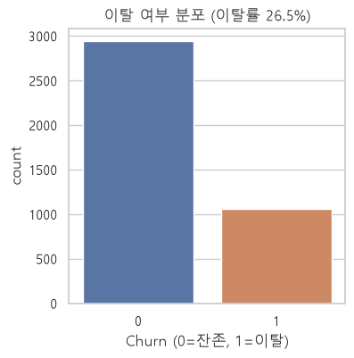

### 3.2 변수 간 상관관계
전체 피처와 `Churn` 간 상관계수를 절댓값 기준으로 정렬한 결과, `Lifetime`(0.438), `Avg_class_frequency_current_month`(0.412), `Age`(0.405), `Contract_period`(0.390), `Month_to_end_contract`(0.381) 순으로 이탈과의 관련성이 높게 나타났다. 반면 `Phone`(0.001), `gender`(0.001)는 이탈과 거의 관계가 없는 것으로 확인되었다. 한편 `Avg_class_frequency_total`과 `Avg_class_frequency_current_month`는 서로 강하게 상관되어 있어(다중공선성) 선형 모델의 계수를 해석할 때 주의가 필요한 것으로 판단되었다.

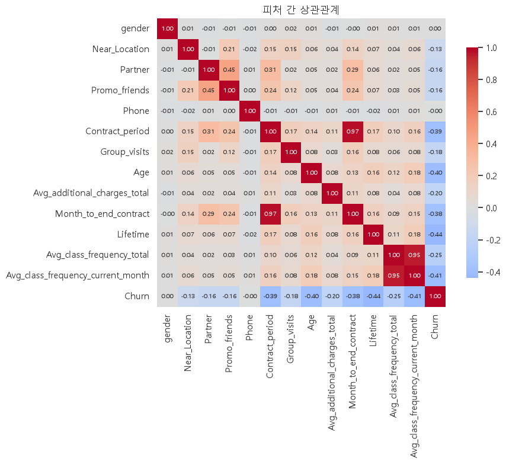

### 3.3 수치형 변수의 이탈 여부별 분포
`Age`, `Lifetime`, `Contract_period`, `Month_to_end_contract`, `Avg_class_frequency_total`, `Avg_class_frequency_current_month`, `Avg_additional_charges_total` 등 주요 수치형 변수의 분포를 이탈 여부별로 비교한 결과, 이탈 회원은 잔존 회원에 비해 `Lifetime`이 짧고, 방문 빈도(특히 이번 달 방문 빈도)가 낮으며, 계약 기간과 잔여 계약 기간이 짧은 쪽에 밀집되어 있는 경향이 뚜렷하게 나타났다.

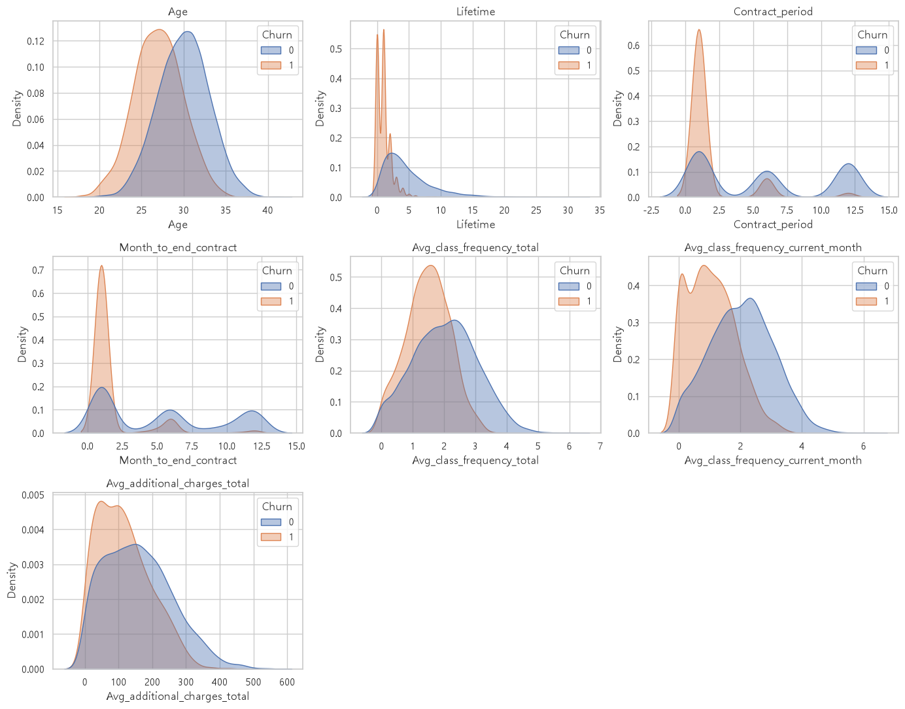

### 3.4 이진 변수별 이탈률
`gender`, `Near_Location`, `Partner`, `Promo_friends`, `Phone`, `Group_visits`의 값에 따른 이탈률을 비교한 결과, 거주지가 센터 근처에 있거나(`Near_Location`), 제휴사 소속이거나(`Partner`), 지인 추천으로 가입했거나(`Promo_friends`), 그룹 수업에 참여하는(`Group_visits`) 회원일수록 이탈률이 낮게 나타난 반면, `gender`와 `Phone`은 이탈률에 뚜렷한 차이를 만들지 않는 것으로 확인되었다.

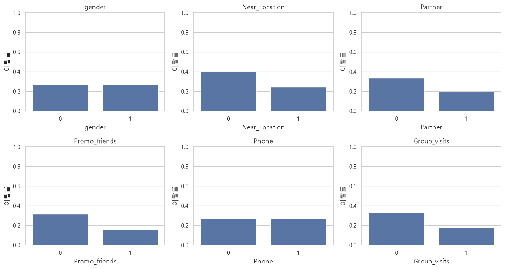

## 4. 데이터 분리 및 전처리
모든 피처가 이미 수치형이므로 별도의 인코딩 과정은 필요하지 않았다. 학습/평가 데이터는 8:2 비율로 분할하였으며, 클래스 비율을 유지하기 위해 `stratify` 옵션을 적용하였다. 그 결과 학습 데이터 3,200건, 평가 데이터 800건으로 분리되었고, 두 데이터셋의 이탈률은 각각 26.5%로 동일하게 유지되었다. 이후 거리 기반 모델인 로지스틱 회귀를 함께 비교하기 위해 `StandardScaler`로 스케일링을 적용하였으며, 파이프라인을 단순화하기 위해 트리 기반 모델에도 동일하게 스케일된 데이터를 공통으로 사용하였다.

## 5. 기본 분류 모델 분석

### 5.1 모델 비교
로지스틱 회귀, 랜덤 포레스트, 그래디언트 부스팅 세 가지 모델을 5-fold 층화 교차검증으로 비교하였다. 이탈 예측에서는 이탈자를 놓치지 않는 재현율(Recall)이 특히 중요하다는 점을 고려하여 정확도, 정밀도, 재현율, F1, ROC-AUC를 함께 확인하였다.

| 모델 | Accuracy | Precision | Recall | F1 | ROC-AUC |
|---|---|---|---|---|---|
| Logistic Regression | 0.9269 | 0.8831 | 0.8351 | 0.8584 | 0.9755 |
| Random Forest | 0.9159 | 0.8624 | 0.8139 | 0.8371 | 0.9708 |
| Gradient Boosting | 0.9306 | 0.8965 | 0.8351 | 0.8647 | 0.9785 |

세 모델 중 Gradient Boosting이 F1과 ROC-AUC 모두에서 가장 높은 성능을 보여, 기본 모델로 선정되었다.

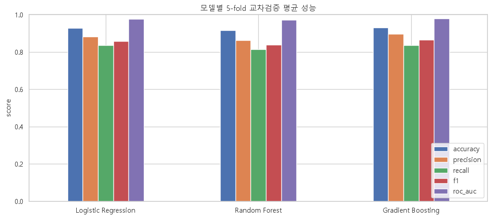

### 5.2 최적 모델 선정 및 평가
교차검증에서 F1이 가장 높았던 Gradient Boosting을 학습 데이터 전체로 재학습한 뒤, 한 번도 사용하지 않은 테스트 세트로 최종 성능을 평가하였다. 그 결과 Accuracy 0.9438, Precision 0.9196, Recall 0.8632, F1 0.8905, ROC-AUC 0.9774로 나타났다. 혼동행렬 기준으로는 잔존(0) 클래스의 정밀도·재현율이 각각 0.95, 0.97로 매우 높았고, 이탈(1) 클래스는 정밀도 0.92, 재현율 0.86으로 상대적으로 재현율이 낮게 나타나, 실제 이탈 회원 중 일부를 놓치는 경향이 있는 것으로 확인되었다.

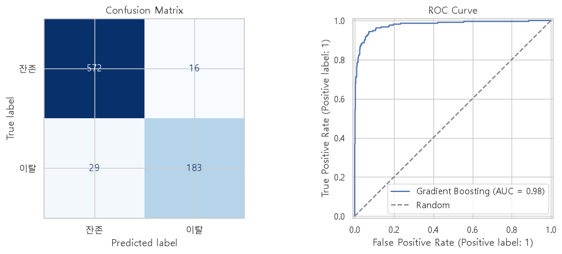

### 5.3 피처 중요도
Gradient Boosting 모델의 피처 중요도를 확인한 결과, 계약·이용 기간과 관련된 변수(`Lifetime`, `Contract_period`, `Month_to_end_contract`)와 방문 빈도 관련 변수(`Avg_class_frequency_current_month`)가 이탈 예측에 가장 크게 기여하는 것으로 나타났으며, 이는 3.2절의 상관관계 분석 결과와 일치하는 결과이다.

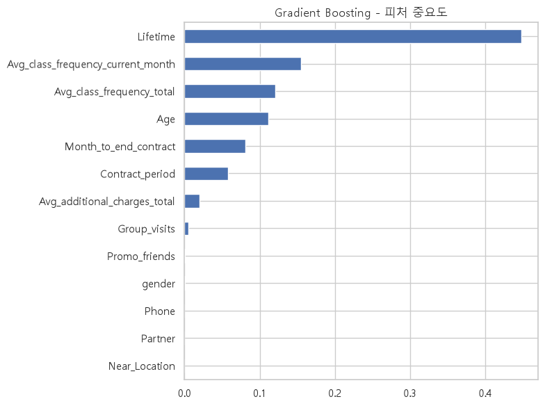

## 6. 군집화 기반 회원 세그먼트 분석
회원을 이용 패턴 및 인적 특성 기준으로 세그먼트화하고, 이 정보가 이탈 예측에 추가적인 도움이 되는지를 검증하였다. K-Means를 사용하였으며, 데이터 누수를 방지하기 위해 학습 데이터(`X_train_scaled`)에만 `fit`을 수행하고 테스트 데이터에는 `predict`만 적용하였다.

### 6.1 최적 군집 수 선정
k를 2부터 10까지 변화시키며 엘보우(inertia)와 실루엣 점수를 확인하였다. 실루엣 점수는 k=2에서 0.166으로 가장 높았으나 전 구간에서 0.12~0.17 수준에 머물러, 이 데이터에는 뚜렷하게 분리되는 자연 군집이 존재하지 않는 것으로 판단되었다(연속형 이용 패턴 데이터에서 흔히 나타나는 특징이다). 엘보우 그래프에서는 k=5 이후 inertia 감소폭이 완만해지는 경향을 보였다. 지나치게 단순한 2분할보다 마케팅·CRM 관점에서 활용 가능한 세그먼트 수가 필요하다는 점을 고려하여, 최종적으로 k=4를 선택하였다.

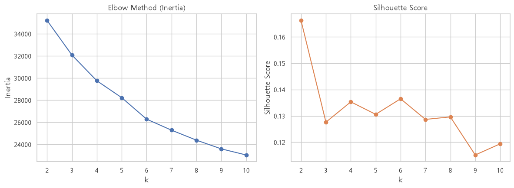

### 6.2 군집별 특성
k=4로 군집화한 결과, 각 군집은 다음과 같은 특징을 보였다.

| Cluster | 회원수 | 이탈률 | 평균 계약기간 | 이번 달 평균 방문빈도 | 해석 |
|---|---|---|---|---|---|
| 0 | 317 | 26% | 4.6개월 | 1.71 | 중간 위험군 |
| 1 | 818 | 3% | 10.8개월 | 1.94 | 장기계약·초저이탈 충성 고객군 |
| 2 | 1,181 | 56% | 1.8개월 | 0.95 | 단기계약·저빈도 고이탈 위험군 |
| 3 | 884 | 9% | 2.5개월 | 2.72 | 단기계약이지만 방문빈도가 높은 저이탈 활동 고객군 |

Cluster 2는 계약 기간이 짧고 방문 빈도가 낮은 회원군으로 이탈률이 56%에 달해 가장 우선적인 리텐션 타겟으로 확인되었다. 반면 Cluster 1은 계약 기간이 길다는 이유만으로 이탈률이 3%까지 낮아졌고, Cluster 3은 계약 기간은 짧지만 방문 빈도가 높아 이탈률이 낮게 나타나, 계약 기간과 방문 빈도가 서로 다른 경로로 이탈을 방지하는 것으로 해석되었다.

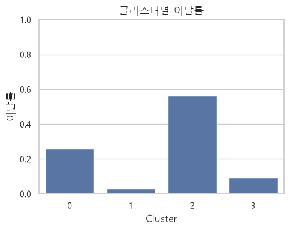

### 6.3 군집 피처 추가 효과 검증
군집 결과를 원-핫 피처로 결합한 데이터셋(`X_train_cl`, 17개 피처)으로 동일한 3개 모델을 재검증한 결과, 로지스틱 회귀는 F1이 0.8584에서 0.8635로, 재현율이 0.8351에서 0.8457로 소폭 개선되었다. 이는 선형 모델이 군집 레이블을 통해 계약 기간·이용 기간·방문 빈도 간의 비선형적 조합 정보를 활용할 수 있게 되었기 때문으로 해석되었다. 반면 Random Forest와 Gradient Boosting은 성능이 소폭 하락하거나 거의 변화가 없었는데, 트리 기반 모델은 원본 피처만으로도 분기(split)를 통해 유사한 조합을 스스로 학습할 수 있어 군집 레이블이 추가 정보를 거의 제공하지 못하고 오히려 차원만 늘려 노이즈로 작용한 것으로 판단되었다. 따라서 군집화의 가치는 모델의 예측 성능 자체보다 회원 세그먼트를 명시적으로 정의하여 리텐션 캠페인을 차등 설계하는 데 있는 것으로 결론지었으며, 이후 고도화 단계는 원본 피처 기반 데이터셋을 기준으로 진행되었다.

## 7. 모델 고도화
기본 모델(Gradient Boosting) 대비 성능을 개선하기 위해 XGBoost 추가, SMOTE를 통한 클래스 불균형 처리, 하이퍼파라미터 튜닝, 임계값 튜닝을 순차적으로 시도하였다.

### 7.1 XGBoost 모델 추가
기존 3개 모델에 XGBoost를 추가하여 동일한 방식으로 5-fold 교차검증을 수행한 결과는 다음과 같다.

| 모델 | Accuracy | Precision | Recall | F1 | ROC-AUC |
|---|---|---|---|---|---|
| Logistic Regression | 0.9269 | 0.8831 | 0.8351 | 0.8584 | 0.9755 |
| Random Forest | 0.9159 | 0.8624 | 0.8139 | 0.8371 | 0.9708 |
| Gradient Boosting | 0.9306 | 0.8965 | 0.8351 | 0.8647 | 0.9785 |
| XGBoost | 0.9337 | 0.8952 | 0.8504 | 0.8720 | 0.9773 |

XGBoost가 F1 0.8720, 재현율 0.8504로 4개 모델 중 F1·재현율 기준 가장 우수한 성능을 보여, 이후 고도화는 XGBoost를 중심으로 진행되었다.

### 7.2 클래스 불균형 처리(SMOTE)
검증 폴드에 합성 데이터가 새어 들어가지 않도록 `imblearn`의 파이프라인으로 SMOTE와 분류기를 묶어 교차검증 내부에서만 오버샘플링이 이루어지도록 하였다. 그 결과 SMOTE는 모든 모델의 재현율을 끌어올리는 효과가 확인되었다(예: 로지스틱 회귀 0.8351 → 0.9058, XGBoost 0.8504 → 0.8658). 다만 그 대가로 정밀도가 하락하여 F1은 대체로 비슷하거나 소폭 낮아졌다(XGBoost 기준 F1 0.8720 → 0.8688). 이에 따라 F1 기준으로는 SMOTE를 적용하지 않은 XGBoost가 근소하게 우세하다고 판단하였으며, 이후 하이퍼파라미터 튜닝은 SMOTE 없는 XGBoost를 대상으로 진행하고, 재현율 확보는 임계값 조정 단계에서 별도로 검토하기로 하였다.

### 7.3 하이퍼파라미터 튜닝
`RandomizedSearchCV`(60회 탐색, F1 기준)로 XGBoost의 하이퍼파라미터를 탐색한 결과, 최적 파라미터는 `n_estimators=500`, `max_depth=2`, `learning_rate=0.1`, `subsample=1.0`, `colsample_bytree=0.8`, `min_child_weight=1`, `gamma=0.3`이었으며 최적 CV F1은 0.8835로 튜닝 전(0.8720) 대비 개선되었다. `max_depth`가 2로 얕게 선택된 점이 특징적인데, 개별 트리는 얕게 유지하고 트리 개수(`n_estimators=500`)를 늘려 과적합을 억제하는 방향으로 정규화가 이루어진 것으로 해석되었다.

튜닝된 XGBoost를 테스트 세트에서 평가한 결과는 다음과 같다.

| 지표 | Baseline (Gradient Boosting) | 튜닝된 XGBoost |
|---|---|---|
| Accuracy | 0.9438 | 0.9450 |
| Precision | 0.9196 | 0.9118 |
| Recall | 0.8632 | 0.8774 |
| F1 | 0.8905 | 0.8942 |
| ROC-AUC | 0.9774 | 0.9804 |

정밀도는 소폭 낮아졌지만 이탈 예측에서 더 중요한 재현율과 F1, ROC-AUC가 모두 개선되어, 실질적인 성능 향상으로 판단되었다.

### 7.4 임계값 튜닝
기본 임계값 0.5 대신 F1을 최대화하는 임계값을 탐색하였다. 테스트 세트로 직접 임계값을 탐색하면 정보 누수가 발생하므로, 학습 데이터에 대한 교차검증 예측 확률(out-of-fold prediction)로 임계값을 정하고 테스트 세트에는 이를 한 번만 적용하였다. 그 결과 OOF 기준 최적 임계값은 0.53(OOF F1=0.8868)으로 나타났으나, 이를 테스트 세트에 적용하자 F1이 0.8942에서 0.8910으로 오히려 소폭 하락하였다. 이는 이번 데이터·분할에서는 기본 임계값 0.5가 이미 충분히 좋은 수준이어서 임계값 튜닝의 추가적인 이득이 크지 않았음을 보여주며, 임계값 튜닝이 항상 성능을 개선하는 것은 아니라는 점을 확인시켜 주었다. 다만 재현율을 정밀도보다 우선하는 비즈니스 정책이라면 임계값을 의도적으로 낮추는 선택도 가능한 것으로 판단되었다.

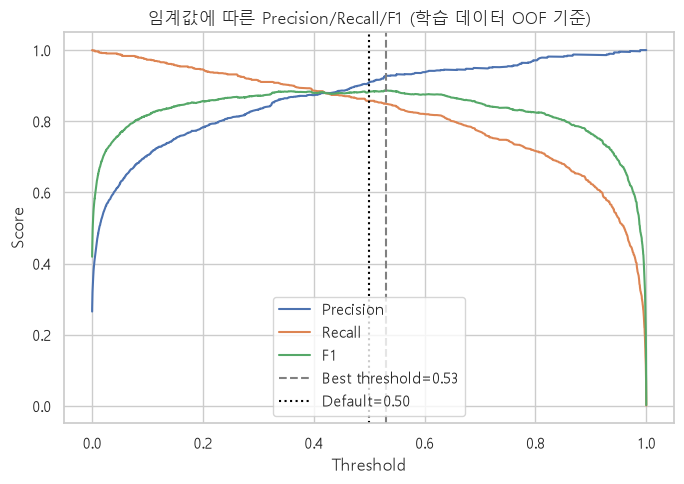

### 7.5 최종 모델 피처 중요도
튜닝된 XGBoost에서도 `Contract_period`(중요도 0.32), `Lifetime`(0.25), `Month_to_end_contract`(0.14)가 가장 중요한 3개 피처로 나타났으며, 이는 기본 모델(5.3절)의 결론과 일치하였다. 계약 관련 변수 3개의 중요도 합이 약 0.71로 전체의 대부분을 차지한다는 점은, 6.2절에서 확인한 군집 프로파일(계약 기간이 짧고 방문 빈도가 낮은 Cluster 2의 이탈률이 56%에 달했던 결과)과도 정확히 부합하는 결과이다.

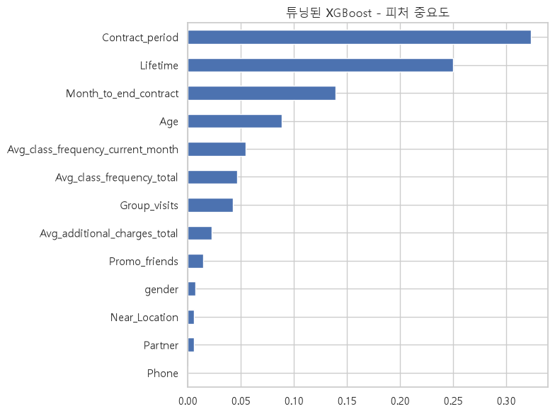

## 8. 이탈 방지 시뮬레이션(Counterfactual 분석)
이탈률 예측 자체는 목적이 아니라 수단이므로, 실제로 방문 빈도나 계약 조건을 개선했을 때 이탈 확률이 얼마나 낮아지는지를 정량적으로 확인하였다. 테스트 세트에서 실제로 이탈한 회원 212명을 대상으로, 6.2절에서 확인한 저이탈 세그먼트(Cluster 1, 이탈률 3.1%)의 평균 수준까지 `Contract_period`, `Lifetime`, `Avg_class_frequency_total`, `Month_to_end_contract`를 각각 하나씩 상향 조정한 뒤, 튜닝된 XGBoost 모델로 조정 전후의 예측 이탈확률을 비교하였다. 조정 전 평균 예측 이탈확률은 0.8406이었다.

| 피처 | 저이탈 세그먼트 기준값 | 조정 후 평균 이탈확률 | 평균 감소폭 | 확률이 감소한 회원 비율 |
|---|---|---|---|---|
| `Lifetime` | 4.74개월 | 0.5046 | 33.6%p | 96.2% |
| `Month_to_end_contract` | 9.94개월 | 0.7311 | 11.0%p | 97.2% |
| `Contract_period` | 10.81개월 | 0.7846 | 5.6%p | 85.4% |
| `Avg_class_frequency_total`(단독) | 1.95 | 0.9205 | -8.0%p(악화) | 3.3% |

`Lifetime`, `Month_to_end_contract`, `Contract_period`는 상향 조정만으로도 이탈확률이 뚜렷하고 일관되게(회원의 85~97%에서) 낮아지는 것으로 나타났다. 특히 `Lifetime`의 효과가 가장 컸는데, 이는 가입 초반 이탈이 전체 이탈의 핵심 동인임을 보여준다. 다만 `Lifetime`은 이미 지나간 이용 기간이므로 회원에게 직접 개입 가능한 지렛대는 아니며, 초기 온보딩·리텐션 케어가 왜 중요한지를 뒷받침하는 진단 지표로 해석하는 것이 타당하다. 반면 `Contract_period`와 `Month_to_end_contract`는 장기 계약 전환 프로모션처럼 실제로 개입 가능한 지렛대에 해당한다.

한편 `Avg_class_frequency_total`만 단독으로 상향 조정했을 때는 이탈확률이 오히려 악화되는 결과가 나타났다. 이는 3.2절에서 확인한 대로 이 피처가 `Avg_class_frequency_current_month`와 다중공선성을 가지고 있기 때문으로, 전체 기간 평균만 인위적으로 높이고 이번 달 방문 빈도는 그대로 두면 모델 입장에서는 "예전엔 자주 왔는데 최근 들어 발길이 뜸해진" 회원처럼 보여 이탈 신호가 오히려 강해진 것으로 해석되었다. 실제로 두 방문 빈도 피처를 함께 저이탈 세그먼트 수준까지 올렸을 때는 이탈확률이 0.8406에서 0.6258로 21.5%p 감소하여, 방문 빈도 개선이 이탈 방지에 실제로 유효하다는 가설이 확인되었다. 4개 피처를 동시에 상향 조정했을 때는 이탈확률이 0.8406에서 0.5927로 24.8%p 감소하였으나, 이 수치에는 `Avg_class_frequency_total` 단독 조정의 왜곡된 효과가 일부 섞여 있어, 방문 빈도 관련 개선 효과는 두 피처를 함께 조정한 21.5%p 감소 수치를 참고하는 것이 더 정확한 것으로 판단되었다.

## 9. 결론
이번 분석을 통해 피트니스 센터 회원의 이탈 여부를 높은 정확도로 예측할 수 있는 모델을 구축하였다. 튜닝된 XGBoost 모델은 테스트 세트 기준 Accuracy 0.9450, F1 0.8942, ROC-AUC 0.9804를 기록하여, 베이스라인(Gradient Boosting) 대비 재현율과 F1, ROC-AUC 모두에서 개선된 성능을 보였다. 군집화 분석에서는 계약 기간이 짧고 방문 빈도가 낮은 세그먼트(Cluster 2)의 이탈률이 56%에 달해, 이 세그먼트가 명확한 고위험군임을 확인하였다. 다만 군집 레이블 자체를 예측 피처로 추가하는 것은 트리 기반 모델의 성능 향상에는 크게 기여하지 않았으며, 오히려 세그먼트를 명시적으로 정의해 리텐션 전략을 차등화하는 용도로 더 유용한 것으로 나타났다. Counterfactual 시뮬레이션 결과, `Lifetime`·`Contract_period`·`Month_to_end_contract`·방문 빈도 개선이 실제 이탈 확률을 유의미하게 낮출 수 있음이 정량적으로 확인되었으며, 이는 향후 이탈 방지 캠페인 설계의 근거로 활용될 수 있다.

## 10. 요약
- 회원 4,000명, 14개 컬럼 데이터에서 결측치·중복 없이 분석을 진행하였으며, 전체 이탈률은 26.52%였다.
- `Lifetime`, `Avg_class_frequency_current_month`, `Contract_period`, `Month_to_end_contract`가 이탈과 가장 밀접한 관련을 보였다.
- 기본 모델(5-fold CV) 중 Gradient Boosting이 가장 우수하였으며, 테스트 세트 F1 0.8905, ROC-AUC 0.9774를 기록하였다.
- K-Means(k=4) 군집화 결과, 단기계약·저빈도 세그먼트(Cluster 2)의 이탈률이 56%로 가장 높았고, 장기계약 세그먼트(Cluster 1)는 3%로 가장 낮았다. 군집 피처는 예측 성능보다 세그먼트 기반 전략 수립에 더 유용하였다.
- XGBoost 추가, 하이퍼파라미터 튜닝을 거친 최종 모델은 테스트 세트 F1 0.8942, Recall 0.8774, ROC-AUC 0.9804로 베이스라인 대비 개선되었다. SMOTE는 재현율을 높이지만 정밀도를 희생하였고, 임계값 튜닝은 이번 데이터 분할에서는 추가 이득을 주지 못하였다.
- Counterfactual 시뮬레이션 결과 `Lifetime` 상향 시 이탈확률이 33.6%p, `Month_to_end_contract` 상향 시 11.0%p, `Contract_period` 상향 시 5.6%p, 방문 빈도(전체+이번 달) 동시 개선 시 21.5%p 감소하는 것으로 나타나, 초반 이탈 방지·장기 계약 전환·방문 빈도 제고가 핵심 리텐션 레버임을 확인하였다.