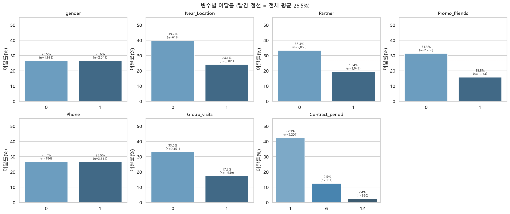
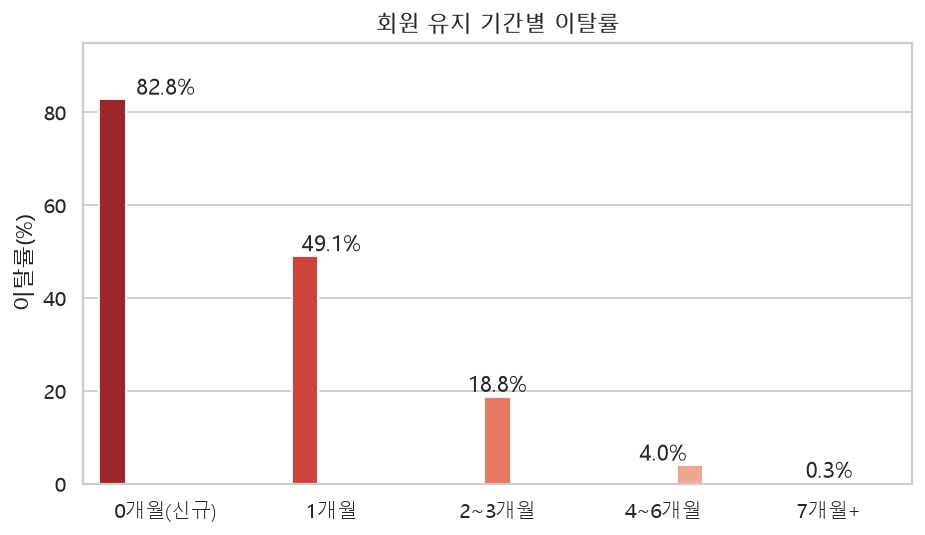
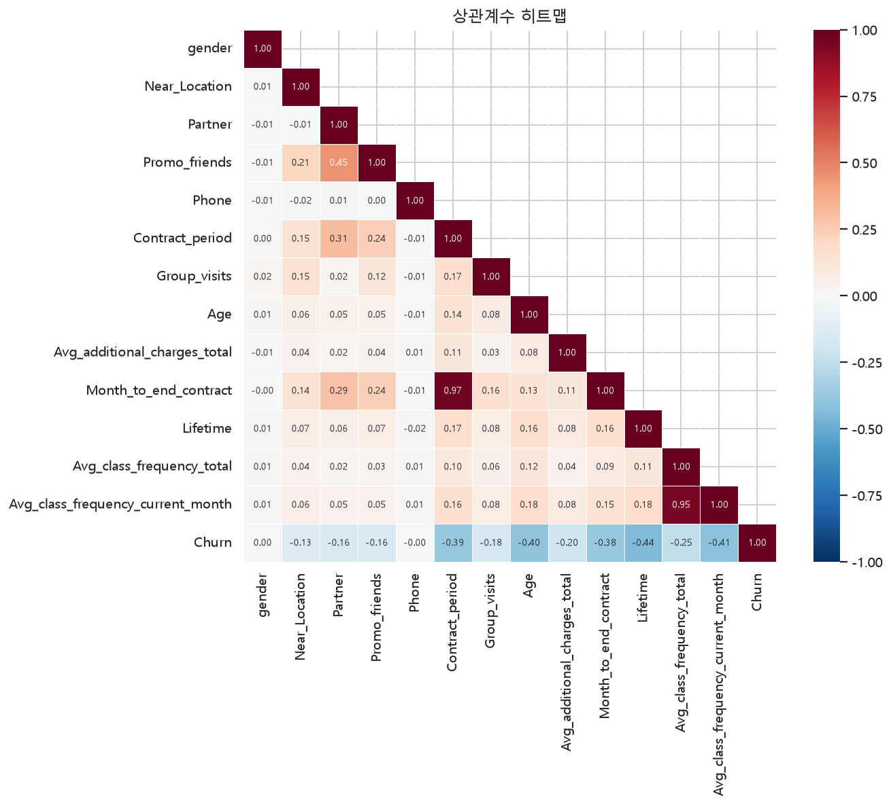
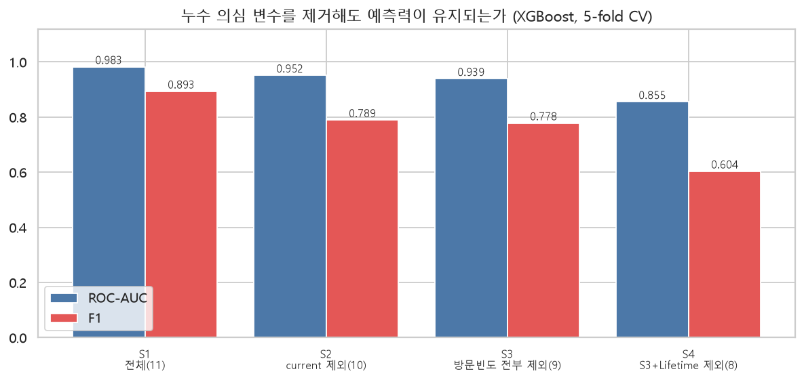
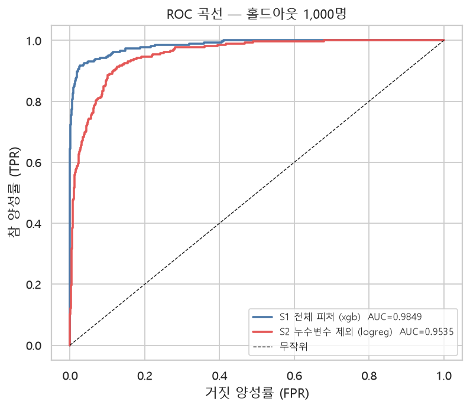
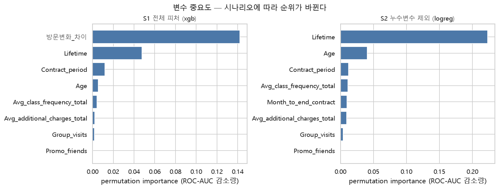
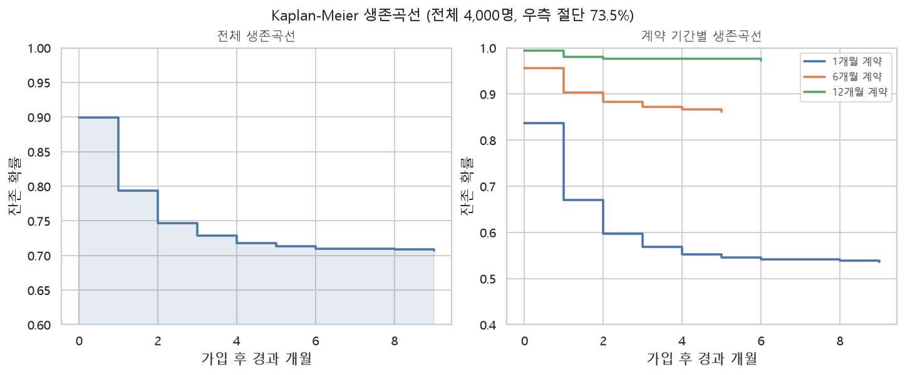
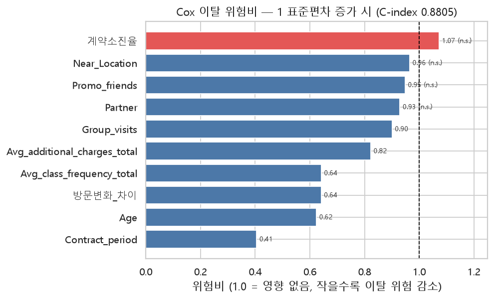
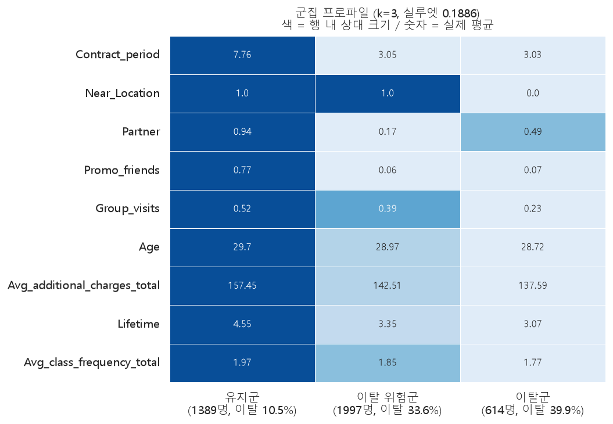
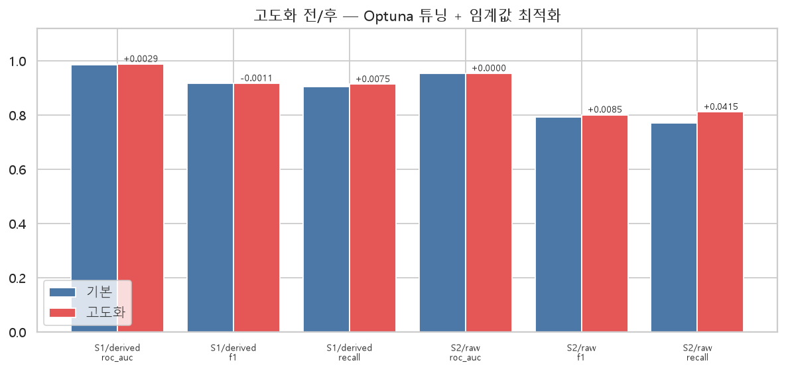

# 분석 4 — 헬스장 고객 이탈 분석

> 데이터 `data/gym_churn_us.csv` (4,000명 × 14변수) · 코드 `src/analysis4/` · `SEED=42` 고정
> **모든 수치는 현재 코드로 재생성한 값임.** 재현 명령은 [5.3절](#53-재현) 참조.

## 요약

| 트랙 | 질문 | 방법 | 최고 성능 | 판정 |
|---|---|---|---|---|
| **A** | 누가 이탈하는가 | 분류 (xgb 고도화, S1/파생) | ROC-AUC **0.9878** | ✅ |
| | | 보수적 구성 (logreg, S2/원본) | ROC-AUC **0.9535** | ✅ |
| **B** | **언제** 이탈하는가 | 생존분석 (Cox) | C-index **0.8805** | ✅ |
| **C** | 어떤 집단으로 나뉘는가 | 군집화 (KMeans k=3) | 실루엣 **0.1886** | △ 등급 분리는 약함 |
| **D** | 무엇을 해야 하는가 | 솔루션 도출 | 액션 3개 | ✅ |

**핵심 발견**

1. **이탈은 가입 직후에 몰림** — 이탈자 1,061명 중 **817명(77.0%)**이 가입 1개월 이내 이탈. 3개월을 넘긴 회원의 이탈은 사실상 사라짐
2. **계약 기간이 압도적인 단일 변수** — 1개월 계약 42.32% vs 12개월 2.40%로 **17.6배** 차이
3. **"언제"는 예측 불가** — 이탈자 내부에 시점 신호가 없음(최대 \|r\| **0.0785**). 생존분석으로 우회해야 성립함
4. **군집은 이탈 강도가 아니라 거리로 갈림** — 등급 판정은 군집이 아니라 트랙 A 확률로 해야 함

---

## 2. EDA

> 재현: `python -m src.analysis4.eda`

### 2.1 데이터 개요

| 행 × 열 | 결측 / 중복 | 타깃 (`Churn`) |
|---|---|---|
| 4,000 × 14 | **0 / 0** | 유지 2,939 (73.5%) / 이탈 **1,061 (26.5%)** |

모든 변수가 숫자로 인코딩되어 있어 전처리 부담이 없음. 불균형은 2.8 : 1로 심하지 않으나 "전부 유지"로도 정확도 73.5%가 나오므로 **ROC-AUC / F1 / Recall**을 지표로 사용함.

### 2.2 변수별 이탈률

**→ 계약 기간이 압도적이며, `gender`·`Phone`은 신호가 전혀 없음**



| 변수 | 대비 (인원) | 이탈률 | 격차 |
|---|---|---|---|
| **계약 기간** | 1개월 (2,207) / 6개월 (833) / 12개월 (960) | **42.32% / 12.48% / 2.40%** | **39.92%p** |
| 그룹수업 참여 | 미참여 (2,351) / 참여 (1,649) | 33.01% / 17.28% | 15.73%p |
| 거주지 근접 | 멀다 (619) / 가깝다 (3,381) | 39.74% / 24.11% | 15.63%p |
| 친구추천 가입 | 아니오 (2,766) / 예 (1,234) | 31.31% / 15.80% | 15.51%p |
| 제휴사 직원 | 아니오 (2,053) / 예 (1,947) | 33.32% / 19.36% | 13.96%p |
| `Phone` | 0 (386) / 1 (3,614) | 26.68% / 26.51% | **0.17%p** |
| `gender` | 0 (1,959) / 1 (2,041) | 26.49% / 26.56% | **0.07%p** |

성별·전화번호는 이탈과 무관함 → **리텐션 캠페인에서 성별 타깃팅은 불필요**함. 통계적 확인은 [3.1.1절](#311-gender--phone--제거).

### 2.3 ★ 이탈은 가입 직후에 집중됨



| 유지 기간 | 0개월 (신규) | 1개월 | 2~3개월 | 4~6개월 | 7개월+ |
|---|---|---|---|---|---|
| 인원 | 487 | 843 | 1,100 | 876 | 694 |
| **이탈률** | **82.8%** | 49.1% | 18.8% | 4.0% | **0.3%** |

이탈자의 **77.0%(817명)**가 가입 1개월 이내에 나감. "누가 이탈하는가"보다 **"가입 초기를 어떻게 넘기게 할 것인가"**가 실무적으로 더 중요함 — 이 발견이 분석 전체의 방향을 정함.

### 2.4 교차 효과

**→ 계약 기간과 그룹수업, 연령과 유지기간이 각각 독립적으로 작동함**

**계약 기간 × 그룹수업 참여별 이탈률(%)** — 괄호는 칸 인원

| 계약 기간 | 그룹수업 X | 그룹수업 O |
|---|---|---|
| 1개월 | **47.5%** (1,449) | 32.5% (758) |
| 6개월 | 15.7% (465) | 8.4% (368) |
| 12개월 | 3.4% (437) | **1.5%** (523) |

최악(1개월 + 미참여)과 최선(12개월 + 참여)의 차이가 **약 32배**임. 그룹수업 참여는 모든 계약 구간에서 일관되게 이탈률을 낮춤.

**연령대 × 유지기간별 이탈률(%)**

| 유지기간 \ 연령 | ~27세 | 28~30세 | 31세+ |
|---|---|---|---|
| **0~1개월** | **81.9%** (565) | 60.7% (438) | 26.9% (327) |
| 2~3개월 | 40.6% (303) | 15.3% (378) | 6.2% (419) |
| 4~6개월 | 8.9% (202) | 3.6% (302) | 1.6% (372) |

같은 신규 회원이라도 27세 이하와 31세 이상의 이탈률이 **55.0%p** 차이 남 → 연령 효과가 유지기간의 부산물이 아님.

### 2.5 다중공선성

**→ 정의상 겹치는 두 쌍이 있어 계수 해석이 왜곡됨. 파생변수로 해소함**



VIF는 **설명변수 11개(S1/raw) 기준**임 — 변수 집합이 달라지면 VIF도 달라지므로 기준을 함께 표기함.

| 변수 쌍 | 상관계수 | VIF |
|---|---|---|
| `Contract_period` ↔ `Month_to_end_contract` | **0.973** | 19.18 / 18.87 |
| `Avg_class_frequency_total` ↔ `..._current_month` | **0.953** | 11.94 / 12.51 |

왜곡의 실제 증거 — 원본 13개 변수로 로지스틱 회귀를 적합하면 `Contract_period`가 **p=0.1063으로 무의미**하게 나옴(EDA 결과와 정반대). 파생변수로 통합하면 VIF가 **1.41**로 떨어지고 Cox 모형에서 **p<0.001**로 유의해짐.

`Churn`과의 상관 상위는 `Lifetime` **-0.438**, `Avg_class_frequency_current_month` -0.412, `Age` -0.405, `Contract_period` -0.390이며, `gender` 0.001 / `Phone` -0.001로 두 변수는 상관 자체가 없음.

---

## 3. 모델링 및 평가

### 3.1 피처 선택 — 측정으로 결정

> 재현: `python -m src.analysis4.validation`
> 조건: `StratifiedKFold(5, shuffle, SEED=42)` · 전체 4,000명 · 지표 ROC-AUC / F1

모델을 고르기 **전에** 무엇을 넣고 뺄지 정하기 위한 측정임. 결정 결과는 `features.py`의 상수로 고정되어 있고 `validation.py`가 근거를 되짚음.

#### 3.1.1 `gender` / `Phone` — 제거

| 검증 | 결과 |
|---|---|
| 카이제곱 독립성 검정 | `gender` **p=0.9929**, `Phone` **p=0.9890** (둘 다 독립) |
| 로지스틱 계수 유의성 (13개, 표준화 후) | p=0.9624 / p=0.9514 — **13개 중 p가 가장 큰 1·2위** |
| 두 변수 제거 시 CV AUC | logreg **+0.0002**, xgb **+0.0005** (오히려 상승) |
| 군집 실루엣 (k=3) | 11축 0.1538 → 9축 **0.1886 (+22.6%)** |

카이제곱은 변수 하나만, 로지스틱 p값은 나머지를 통제한 뒤 보는 검정임 → 두 방향 모두 무신호로 나와야 제거 근거가 됨. 효과가 가장 큰 곳은 **군집화**임 — KMeans는 모든 축을 동등하게 보므로 분류에서 무해한 변수가 실루엣을 끌어내림.

#### 3.1.2 `Age` — 유지

| 검증 | 결과 |
|---|---|
| 제거 시 CV AUC | logreg **-0.0102**, xgb **-0.0046** (두 모델 모두 하락) |
| 순열 중요도 (S1/derived, xgb) | 11개 중 **4위** (0.0056) |
| 연령대별 이탈률 | 18~24세 **66.2%** → 34세+ **3.3%** (단조 감소) |
| `Lifetime`과의 상관 | **0.165** (독립적) |

`Lifetime`의 대리변수일 가능성을 검토했으나, **같은 유지기간 구간 내부에서도 연령 차이가 유지**되어([2.4절](#24-교차-효과)) 독립 신호임이 확인됨.

#### 3.1.3 딥러닝 — 도입하지 않되, 이유는 성능이 아님

| 모델 | 13개 원본 AUC | F1 | S1/derived AUC | F1 |
|---|---|---|---|---|
| XGBoost | **0.9822** | **0.8931** | 0.9882 | 0.9130 |
| LogisticRegression | 0.9766 | 0.8571 | 0.9764 | 0.8646 |
| MLP(64,32) | 0.9725 | 0.8530 | **0.9887** | **0.9160** |
| MLP(128,64,32) | 0.9744 | 0.8586 | 0.9875 | 0.9049 |

원본 피처에서는 MLP가 두 모델 모두에 밀리지만, **파생변수를 적용한 최종 구성에서는 MLP(64,32)가 XGBoost를 +0.0005 앞섬.** "정형 데이터에 딥러닝은 안 된다"는 일반론으로 정리할 수 없음. 도입하지 않는 실제 이유는 다음임.

- **+0.0005는 의미 있는 차이가 아님** — 5-fold 폴드 간 표준편차보다 작아 조건이 바뀌면 순위가 뒤집힘
- **설명할 수 없음** — 최종 산출물은 리텐션 액션이고 그 근거는 순열 중요도와 Cox 계수에서 나옴
- **용량을 키워도 나아지지 않음** — MLP(128,64,32)는 오히려 **-0.0012** 하락. 모델이 작아서가 아니라 문제 자체가 단순함

→ `torch`/`tensorflow`는 도입하지 않고 MLP를 후보 4종에 남겨 비교군으로 보고함.

#### 3.1.4 파생변수 — 베이스라인 **이후**에 적용

파생변수는 '추가'가 아니라 '대체'로 사용함. 원본을 남기면 중복 정보가 잡음이 됨.

| 파생변수 | 정의 (대체 대상) | CV AUC 델타 (xgb / rf / logreg) |
|---|---|---|
| `계약소진율` | `1 - 잔여개월/계약개월` (`Month_to_end_contract`) | +0.0002 / +0.0008 / -0.0001 |
| `방문변화_차이` | `직전달 - 전체` 방문빈도 (`..._current_month`) | +0.0054 / **+0.0137** / -0.0003 |

기준값은 원본 11개의 xgb 0.9826 / rf 0.9737 / logreg 0.9767임. 두 파생변수의 성격이 정반대임.

- **`계약소진율`** — **84.0%가 0에 몰려** 예측 기여는 거의 없음. 대신 `Contract_period` VIF를 **19.18 → 1.41**로 낮춰 계수 해석을 가능하게 함
- **`방문변화_차이`** — **트리 계열에만** 이득임(rf +0.0137). 두 원본의 **선형 결합**이라 선형 모델에는 새 정보가 0이기 때문임

> **순서가 중요함.** 파생변수를 먼저 넣었다면 위 표를 만들 수 없음 — 베이스라인은 파생변수의 가치를 재는 자(尺)임.
> 비율(÷)이 아니라 차이(−)를 쓴 이유는 `Avg_class_frequency_total == 0`인 고객이 **88명** 있어 0으로 나누기가 발생하기 때문임.

#### 3.1.5 ★ 누수 의심 변수 검증

`Avg_class_frequency_current_month`의 중요도가 압도적이라 이 변수 하나로 성능이 나오는 것인지 확인함. **S3·S4는 진단 전용**이며 학습에는 쓰지 않음.



| 시나리오 | 피처 | ROC-AUC | F1 | S1 대비 |
|---|---|---|---|---|
| **S1** 전체 | 11 | **0.9826** | 0.8935 | — |
| **S2** 직전달 방문 제외 | 10 | **0.9516** | 0.7893 | -0.0310 |
| S3 방문빈도 전부 제외 | 9 | 0.9390 | 0.7783 | -0.0436 |
| S4 S3 + `Lifetime` 제외 | 8 | 0.8554 | 0.6035 | **-0.1272** |

- 문제의 변수를 빼도 AUC **0.95**가 나옴 → 특정 변수에 기생하지 않음. **누수 걱정은 과했음**
- 다만 F1이 0.89 → 0.79로 무시할 수 없게 떨어짐 → **S1·S2 병행 보고**를 원칙으로 삼음
- 부수적으로 **진짜 핵심 변수는 `Lifetime`**임이 드러남 (S3 → S4에서 **-0.0836**, 단일 변수 최대 낙폭)

#### 3.1.6 이상치 · 불균형 · 데이터 규모

**이상치 — 제거하지 않음.** `Lifetime` IQR 이상치(> 11.0개월) **192명의 이탈률이 0.0%**(그 외 3,808명은 27.9%)임. 최우량 장기회원이므로 지우면 신호가 가장 강한 구간을 버리게 됨.

**불균형 처리 — 기본은 미적용**

| 방식 | ROC-AUC | F1 | Recall | Precision |
|---|---|---|---|---|
| 미적용 | 0.9882 | 0.9130 | 0.8954 | **0.9314** |
| `scale_pos_weight` | **0.9884** | 0.9130 | 0.9152 | 0.9109 |
| SMOTE | 0.9883 | 0.9114 | **0.9161** | 0.9068 |

AUC 차이는 **0.0002**로 무의미하며 지표별로 승자가 갈림 — Precision은 미적용, Recall은 SMOTE가 최고임. 미적용을 기본으로 두는 이유는 ① 전처리 단계가 줄고 ② **Precision이 가장 높아** 잘못된 개입 비용을 줄이며 ③ Recall이 필요하면 `build_models(balanced=True)`로 즉시 전환되기 때문임.

**데이터 추가 수집 — 불필요.** 학습곡선이 640 → 3,200 표본에서 AUC 0.9839 → 0.9882로 오르지만 마지막 구간 기울기가 **+0.0008**로 포화 상태임.

---

### 3.2 트랙 A — 이탈 예측 (분류)

> 재현: `python -m src.analysis4.classification`
> 홀드아웃 75%(3,000) / 25%(1,000) 층화 분할 · 교차검증은 train 내부에서만

**기본 모델 성능 (holdout test 1,000명)**

| 구성 | 1위 모델 | ROC-AUC | F1 | Recall | Precision |
|---|---|---|---|---|---|
| **S1 / 파생 적용** | **xgb** | **0.9849** | 0.9178 | 0.9057 | 0.9302 |
| S1 / 원본 | xgb | 0.9783 | 0.8850 | 0.8566 | 0.9153 |
| S2 / 파생 적용 | logreg | 0.9536 | 0.7946 | 0.7736 | 0.8167 |
| **S2 / 원본** | **logreg** | **0.9535** | 0.7922 | 0.7698 | 0.8160 |



**파생변수 델타 (derived − raw, test AUC)** — RandomForest **+0.0172**, MLP +0.0076, XGBoost +0.0066, LogisticRegression +0.0003 (S1 기준). [3.1.4절](#314-파생변수--베이스라인-이후에-적용)의 예측이 홀드아웃에서 그대로 재현됨 → **트리 계열만 이득, 선형 모델은 0.** S2에서는 델타가 -0.0017 ~ +0.0011로 사라지는데, `방문변화_차이`를 쓸 수 없어 `계약소진율`만 대체되기 때문임.

**★ 시나리오에 따라 최적 모델이 바뀜** — **S2에서는 로지스틱회귀가 XGBoost를 앞섬**(0.9535 vs 0.9466). 강한 변수가 빠지면 트리의 이점이 사라지고 선형 구조가 더 잘 맞음 → 모델을 미리 정하지 않고 시나리오별로 선정함(`PRIMARY_MODEL = {"S1": "xgb", "S2": "logreg"}`).



중요도 순위도 시나리오마다 달라짐. S1/derived에서는 `방문변화_차이`(0.1420) 1위, `Lifetime`(0.0476) 2위임.

---

### 3.3 트랙 B — 이탈 타이밍 (생존분석)

> 재현: `python -m src.analysis4.regression`

타깃은 `Lifetime`. 세 접근을 비교했고 **B-2만 성공**함.

| 안 | 방법 | 데이터 | 결과 |
|---|---|---|---|
| B-1 | 순서형 분류 (0 / 1 / 2개월+) | 이탈자 1,061 | ❌ macro F1 0.3451 < 무작위 0.3602 |
| **B-2** | **생존분석 (Cox)** | **전체 4,000** | ✅ **C-index 0.8805** |
| B-3 | 회귀 | 이탈자 1,061 | ❌ RMSE 1.2079 > 평균 예측 1.2065 |

> **최초 계획은 "B-1 주력, B-2는 여력 되면"이었으나 실측 결과가 정반대였음.**

#### 실패 원인 — 모델이 아니라 데이터임

| 진단 | 결과 |
|---|---|
| 이탈자 내부 피처↔개월수 최대 상관 | **\|r\| = 0.0785** |
| 이진 재정의 (0개월 vs 1개월+) AUC | **0.4427** |
| 이진 재정의 (0~1개월 vs 2개월+) AUC | **0.4696** |
| *대조: 같은 피처(10개)로 이탈 **여부** 예측* | ***0.9697*** |

**이 피처들은 "누가 이탈하는가"는 알지만 "언제 이탈하는가"는 모름.** 이탈 여부를 가르는 정보는 트랙 A에서 소진되고 이탈자 집단 **내부**에는 잔여 신호가 없음. 이진 재정의 AUC가 0.5 미만이라는 것은 무작위보다도 못하다는 뜻임.

> ⚠ **베이스라인 선택에 함정이 있었음.** 처음에는 `최빈` 기준선(macro F1 0.1874)만 두고 "xgb 0.3451로 개선"처럼 보였음. 그러나 최빈 클래스만 답하면 나머지 두 클래스의 F1이 0이라 macro 평균이 부당하게 눌림. **계층 비율대로 찍는 무작위 기준선(0.3602)이 정직한 기준**이며 이를 넘은 모델은 없음.

#### 성공 — B-2 생존분석

유지자 2,939명을 우측 절단(**73.5%**)으로 포함해 **4,000명 전부**를 활용함. 적합 3,000명 / **C-index는 test 1,000명에서 측정**한 값임.



전체 잔존율은 0.899 → **0.793**(1개월) → 0.747(2개월)로 급락한 뒤 완만해짐. 계약 기간별 2개월 시점 잔존율은 **1개월 계약 0.596 / 6개월 0.883 / 12개월 0.976**으로 극명하게 갈림.



**Cox 계수 (표준화 후, 유의한 6개)** — 표준화 기준은 train만 보고 정함

| 피처 | 계수 | 위험비 | p | 1 표준편차 증가 시 |
|---|---|---|---|---|
| `Contract_period` | -0.8949 | **0.409** | <0.001 | 이탈 위험 **59.1% 감소** |
| `Age` | -0.4755 | 0.622 | <0.001 | 37.8% 감소 |
| `방문변화_차이` | -0.4498 | 0.638 | <0.001 | 36.2% 감소 |
| `Avg_class_frequency_total` | -0.4456 | 0.640 | <0.001 | 36.0% 감소 |
| `Avg_additional_charges_total` | -0.1946 | 0.823 | <0.001 | 17.7% 감소 |
| `Group_visits` | -0.1048 | 0.901 | 0.010 | 9.9% 감소 |

나머지 4개는 유의하지 않음 — `Partner` p=0.070, `Promo_friends` p=0.256, `Near_Location` p=0.256, `계약소진율` p=0.325. `계약소진율`이 유의하지 않은 것은 [3.1.4절](#314-파생변수--베이스라인-이후에-적용)과 일관됨(역할이 예측이 아니라 다중공선성 해소임). **`Promo_friends`·`Partner`가 유의하지 않다는 점은 [액션 3](#52-리텐션-솔루션-트랙-d)의 근거 강도에 직접 영향을 줌.**

---

### 3.4 트랙 C — 군집화

> 재현: `python -m src.analysis4.clustering`

**→ 군집은 이탈 강도가 아니라 거리로 갈림. 등급 판정은 트랙 A 확률로 대체함**

`Churn`(정답 누출), `gender`·`Phone`(무신호), 다중공선성 쌍의 한쪽을 제외한 **9개 축**으로 군집화함. **k=3이 실루엣 최댓값**(0.1886)이었고 목표 등급 수와 우연히 일치함 — 3등급이 필요해서 k=3으로 정한 것이 아님.



| | 유지군 (1,389) | 이탈 위험군 (1,997) | 이탈군 (614) |
|---|---|---|---|
| **이탈률** | **10.5%** | 33.6% | **39.9%** |
| 계약 기간 | **7.76개월** | 3.05 | 3.03 |
| 거주지 근접 | 1.00 | 1.00 | **0.00** |
| 제휴사 직원 | **0.94** | 0.17 | 0.49 |
| 친구추천 | **0.77** | 0.06 | 0.07 |
| 그룹수업 참여 | 0.52 | 0.39 | 0.23 |

- **유지군은 뚜렷함** — 장기계약(7.76개월) + 제휴사(0.94) + 친구추천(0.77)이 겹친 집단임
- **이탈군과 위험군을 가르는 것은 거주지 근접성임** — 계약 기간이 3.05 vs 3.03으로 사실상 같고 `Near_Location`만 1.00 vs 0.00으로 완전히 갈림 → 이탈률 격차가 **6.3%p**에 그치는 이유임

> 이 군집화는 "이탈 위험 사다리"가 아니라 **"우량 고객 vs 나머지"를 가른 뒤 나머지를 거리로 쪼갠 것**임. 실패가 아니라 해석해야 할 결과임 — 비지도 학습은 `Churn`을 모르므로 데이터에 실재하는 축(계약·제휴·거리)을 찾아낸 것임.

**검증** — Ward 군집과의 ARI **0.6420**(중간 일치), 실루엣 0.1886 vs **0.1883**으로 사실상 동일함. 다른 알고리즘도 비슷한 분할에 도달했다는 근거지만, PCA 설명분산이 2D **35.4%** / 3D **47.3%**에 불과해 산점도로 "잘 갈렸다"고 주장할 수는 없음.

**따라서 등급 판정은 군집 단독으로 하지 않음**

| 방식 | 저위험 | 중위험 | 고위험 | 격차 |
|---|---|---|---|---|
| 군집 단독 (이탈률) | 10.5% | 33.6% | 39.9% | 29.4%p |
| **트랙 A 예측확률 3분위** | **0.0%** | 0.9% | **78.7%** | **78.7%p** |

저위험 1,334명 중 이탈자가 **0명**임 → **등급은 트랙 A 확률로, 군집은 "왜 그 등급인가"를 설명하는 프로파일로** 사용함.

---

## 4. 모델 고도화

> 재현: `python -m src.analysis4.train`
> ⚠ **Optuna(30 trial)와 임계값 모두 train 교차검증(out-of-fold)에서만 결정함.** test로 정하면 전/후 비교가 무의미해짐.



| 구성 | 모델 | ROC-AUC | F1 | Recall | Precision | 임계값 |
|---|---|---|---|---|---|---|
| S1/파생 | xgb 기본 | 0.9849 | 0.9178 | 0.9057 | 0.9302 | 0.5 |
| | xgb **고도화** | **0.9878** | 0.9167 | 0.9132 | 0.9202 | **0.3943** |
| | 변화 | **+0.0029** | -0.0011 | +0.0075 | -0.0100 | |
| S2/원본 | logreg 기본 | 0.9535 | 0.7922 | 0.7698 | 0.8160 | 0.5 |
| | logreg **고도화** | 0.9535 | **0.8007** | **0.8113** | 0.7904 | **0.4021** |
| | 변화 | 0.0000 | **+0.0085** | **+0.0415** | -0.0256 | |

**S2의 AUC는 전혀 오르지 않았지만 F1과 Recall은 오름.** AUC는 임계값과 무관한 지표이고 로지스틱회귀는 하이퍼파라미터 여지가 좁으므로 **이득의 전부가 임계값 최적화에서 나옴.** 다만 공짜가 아님 — Recall **+0.0415**의 대가로 Precision **-0.0256**을 내줌.

두 모델 모두 0.5보다 낮은 임계값이 최적임 → 이탈(양성)이 26.5%인 데이터에서 기본값 0.5는 양성을 과소 예측함.

---

## 5. 결론

### 5.1 리텐션 솔루션 (트랙 D)

솔루션은 **개입 가능한 변수**에서만 도출함. "20대가 많이 이탈하니 20대를 줄이자"는 실행 불가능한 결론임.

| 구분 | 변수 | 활용 |
|---|---|---|
| **고정** (개입 불가) | `Age`, `Near_Location` | 대상 선정 기준 |
| **레버** (개입 가능) | `Contract_period`, `Group_visits`, `Promo_friends`, `Partner` | 실제 수단 |
| **모니터링** | `Lifetime`, 방문 빈도 | 개입 타이밍·효과 측정 |

| 우선순위 | 액션 | 대상 (인원) | 현재 이탈률 | 수단 | 근거 |
|---|---|---|---|---|---|
| **1** | 27세 이하 신규 회원 온보딩 | 27세 이하 × 가입 0~1개월 (**565명**) | **81.9%** | 그룹수업 배정 · 첫 달 집중 관리 | 그룹수업 참여 시 33.01% → 17.28% (**-15.73%p**). 이탈자의 77%가 가입 1개월 이내 |
| **2** | 단기계약 · 그룹수업 미참여 전환 | 1개월 계약 × 그룹수업 미참여 (**1,449명**) | **47.5%** | 장기계약 전환 인센티브 · 그룹수업 무료 체험 | Cox 기준 계약 기간 1 표준편차 증가 시 이탈 위험 **59.1% 감소** — 단일 레버 중 최대 |
| **3** | 친구추천 · 제휴 채널 확대 | 추천·제휴 경로 없이 가입 (**1,837명**) | 34.5% | 추천 리워드 · 제휴사 확대 | 친구추천 15.80% (미추천 31.31%) / 제휴사 19.36% (비제휴 33.32%) |

⚠ **액션 3은 근거가 약함** — 이 레버는 Cox 모형에서 유의하지 않았음(`Promo_friends` p=0.256, `Partner` p=0.070). 다른 변수를 통제하면 독립 효과가 확인되지 않으므로 **단변량 이탈률 격차만 근거로 삼는 점을 감안해야 함.**

> ⚠ **위 수치는 상관이지 인과가 아님.** 12개월 계약자는 애초에 이탈 의향이 낮은 사람일 수 있음(자기선택 편향). *"장기계약으로 전환하면 이탈률이 39.92%p 낮아진다"*가 아니라 *"장기계약 집단의 이탈률이 39.92%p 낮게 관측된다"*로 읽어야 하며, 실제 효과 검증에는 **A/B 테스트**가 필요함.

### 5.2 한계

| # | 한계 | 근거 |
|---|---|---|
| 1 | **인과 추론 불가** — 관측 데이터이므로 모든 결론이 상관 수준임 | — |
| 2 | **이탈 시점 예측 실패** — 이탈자 내부에 "언제"를 가르는 신호가 없음. 시계열 이용 로그가 필요함 | 최대 \|r\| 0.0785 |
| 3 | **군집 분리도 약함** — 등급 판정은 분류 확률로 대체함 | 실루엣 0.1886, 격차 6.3%p |
| 4 | **액션 3의 근거가 약함** — 단변량 격차는 크지만 Cox 다변량에서는 유의하지 않음 | p=0.256 / 0.070 |
| 5 | **`gender` 코딩 불명** — 0/1이 어느 성별인지 원본에 명시가 없음 (이탈과 무관하므로 분석 영향은 없음) | p=0.9929 |
| 6 | **단일 시점 스냅샷** — 계절성이나 추세를 볼 수 없음 | — |

### 5.3 재현

```bash
python -m src.analysis4.validation       # 3.1절 피처 선택 검증
python -m src.analysis4.eda              # 2절 EDA
python -m src.analysis4.train            # 세 트랙 + 고도화 → summary.joblib
python -m src.analysis4.train --no-tune  # 기본 학습만 (빠름)
python -m src.analysis4.classification   # 트랙 A 단독 (3.2 / 4절)
python -m src.analysis4.regression       # 트랙 B 단독 (3.3절)
python -m src.analysis4.clustering       # 트랙 C 단독 (3.4절)
streamlit run app.py                     # 페이지 (학습 없이 저장 결과만 읽음)
```

모든 난수는 `SEED=42`로 고정되어 있으며, 재실행 시 `summary.joblib`의 **97개 지표가 동일하게 재생성**됨을 확인함. `models/`는 `.gitignore` 대상이므로 위 명령으로 재생성함.

---

## 6. 분석 요약 (최종 레포트용)

> 이 절은 최종 레포트에 그대로 옮겨 쓸 수 있도록 위 내용을 독립적으로 정리한 것임.

### 6.1 무엇을 했는가

헬스장 회원 4,000명 × 14변수 스냅샷 데이터(`gym_churn_us.csv`, 결측·중복 0, 이탈률 26.5%)로 **이탈 문제를 네 개의 질문으로 분해**해 각각 별도 트랙으로 풀었음.

| 트랙 | 질문 | 방법 | 결과 |
|---|---|---|---|
| **A** | 누가 이탈하는가 | 분류 (logreg / rf / xgb / MLP + Optuna 30 trial) | ROC-AUC **0.9878** (S1/xgb 고도화), 보수 구성 **0.9535** (S2/logreg) |
| **B** | 언제 이탈하는가 | 순서형 분류 → 회귀 → 생존분석(Cox) | 앞의 두 안은 실패, Cox **C-index 0.8805** |
| **C** | 어떤 집단으로 나뉘는가 | KMeans(k=3) · Ward 교차검증 | 실루엣 **0.1886** — 분리 약함, 등급 판정은 트랙 A로 대체 |
| **D** | 무엇을 해야 하는가 | 개입 가능 변수만으로 솔루션 도출 | 우선순위 3개 액션 |

모델링 이전에 **피처 선택을 측정으로 결정**한 것이 이 분석의 골격임 — `gender`·`Phone`은 카이제곱(p=0.99)·로지스틱 계수(p=0.95↑)·제거 시 CV AUC 상승(+0.0002/+0.0005)의 세 방향이 모두 무신호로 나온 뒤에 제거했고, `Age`는 제거 시 두 모델 모두 AUC가 떨어져(-0.0102/-0.0046) 유지했음. 파생변수도 **베이스라인 이후**에 적용해 각 변수의 순기여(rf +0.0137 등)를 측정 가능하게 남겼음.

### 6.2 핵심 발견 4가지

1. **이탈은 가입 직후에 몰려 있음** — 이탈자 1,061명 중 **817명(77.0%)**이 가입 1개월 이내에 이탈. 유지기간별 이탈률은 신규 82.8% → 1개월 49.1% → 7개월+ **0.3%**로, 3개월을 넘긴 회원의 이탈은 사실상 소멸함. 따라서 문제의 본질은 "누구를 잡을까"가 아니라 **"가입 초기 3개월을 어떻게 넘기게 할까"**임.
2. **계약 기간이 압도적인 단일 레버** — 1개월 계약 42.32% vs 12개월 2.40%(**17.6배**, 39.92%p). Cox에서도 1 표준편차 증가 시 이탈 위험 **59.1% 감소**로 전 변수 중 최대. 그룹수업 참여와 결합하면 최악(1개월+미참여 47.5%)과 최선(12개월+참여 1.5%)이 **약 32배** 벌어짐.
3. **"언제"는 이 데이터로 예측 불가** — 이탈자 집단 *내부*의 피처↔이탈개월 최대 상관이 **|r|=0.0785**, 이진 재정의 AUC는 0.44~0.47로 무작위 이하임. 같은 피처로 이탈 *여부*는 AUC 0.9697이 나오므로 **모델 문제가 아니라 데이터에 시점 신호가 없는 것**이며, 유지자를 우측 절단(73.5%)으로 포함하는 생존분석으로 우회해야 성립함(C-index 0.8805).
4. **군집은 이탈 강도가 아니라 거리로 갈림** — 이탈군과 위험군은 계약 기간이 3.03 vs 3.05로 같고 `Near_Location`만 0.00 vs 1.00으로 갈려 이탈률 격차가 **6.3%p**에 그침. 반면 트랙 A 예측확률 3분위는 **0.0% / 0.9% / 78.7%**로 갈리고 저위험 1,334명 중 이탈자가 **0명**임 → 등급은 분류 확률로, 군집은 그 등급의 *이유*를 설명하는 프로파일로 역할을 분리함.

### 6.3 방법론적 판단과 그 근거

- **누수 의심을 측정으로 해소** — `Avg_class_frequency_current_month`를 빼도 AUC 0.9516이 나와 특정 변수 기생이 아님을 확인함. 다만 F1이 0.89→0.79로 떨어져 **S1(전체)·S2(보수) 병행 보고**를 원칙으로 삼았고, 이 과정에서 진짜 핵심 변수가 `Lifetime`(단독 제거 시 -0.0836)임이 드러남.
- **시나리오에 따라 최적 모델이 바뀜** — S1은 xgb, **S2는 로지스틱회귀가 xgb를 앞섬(0.9535 vs 0.9466)**. 강한 변수가 빠지면 트리의 이점이 사라짐 → 모델을 미리 고정하지 않고 시나리오별로 선정함.
- **딥러닝은 성능이 아니라 다른 이유로 배제** — 최종 구성에서 MLP(64,32)가 xgb를 +0.0005 앞섰으나 폴드 간 표준편차보다 작은 차이이고, 용량을 키우면 오히려 -0.0012 하락함. 최종 산출물이 *설명 가능한* 리텐션 액션이므로 비교군으로만 남김.
- **하지 않기로 한 것들도 측정 후 결정** — 이상치 제거 안 함(`Lifetime` 이상치 192명의 이탈률이 **0.0%**, 최우량 장기회원), 불균형 처리 미적용 기본(AUC 차이 0.0002, Precision 최고), 데이터 추가 수집 불필요(학습곡선 마지막 구간 기울기 +0.0008로 포화).
- **튜닝·임계값은 train out-of-fold에서만 결정** — S2는 AUC가 0.0000 변화한 반면 Recall이 **+0.0415** 올랐는데, 이득 전부가 임계값(0.4021)에서 나온 것임. 두 모델 모두 최적 임계값이 0.5보다 낮아, 양성 26.5% 데이터에서 기본값 0.5는 양성을 과소 예측함을 확인함.

### 6.4 결론 — 실행 가능한 리텐션 액션

변수를 **고정(`Age`, `Near_Location` — 대상 선정용) / 레버(`Contract_period`, `Group_visits`, `Promo_friends`, `Partner` — 실제 수단) / 모니터링(`Lifetime`, 방문빈도)**으로 나눈 뒤, 레버에서만 액션을 도출했음.

| 순위 | 액션 | 대상 (인원) | 현재 이탈률 | 근거 강도 |
|---|---|---|---|---|
| **1** | 27세 이하 신규 회원 온보딩 (그룹수업 배정 · 첫 달 집중 관리) | 27세 이하 × 0~1개월 (**565명**) | **81.9%** | 강함 — 이탈자 77%가 1개월 내, 그룹수업 -15.73%p |
| **2** | 단기계약·미참여 회원의 장기계약 전환 및 그룹수업 무료 체험 | 1개월 계약 × 미참여 (**1,449명**) | **47.5%** | 강함 — Cox 위험 **59.1% 감소**, 단일 레버 최대 |
| **3** | 친구추천·제휴 채널 확대 | 추천·제휴 없이 가입 (**1,837명**) | 34.5% | **약함** — Cox 다변량에서 비유의(p=0.256 / 0.070) |

**한계 (해석 시 반드시 함께 읽어야 할 것)** — ① 관측 데이터이므로 모든 결론은 상관이며 인과가 아님. *"장기계약으로 전환하면 39.92%p 낮아진다"*가 아니라 *"장기계약 집단이 39.92%p 낮게 관측된다"*로 읽어야 하고(자기선택 편향), 실제 효과 검증에는 **A/B 테스트**가 필요함. ② 이탈 시점 예측은 실패했고 이를 풀려면 **시계열 이용 로그**가 필요함. ③ 군집 분리도가 약해 등급 판정은 분류 확률로 대체함. ④ 액션 3은 단변량 격차만이 근거임. ⑤ 단일 시점 스냅샷이라 계절성·추세를 볼 수 없음.

**재현성** — 전 과정 `SEED=42` 고정, 재실행 시 `summary.joblib`의 **97개 지표가 동일하게 재생성**됨을 확인함([5.3절](#53-재현)).
