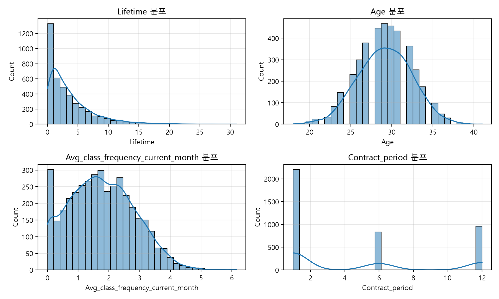
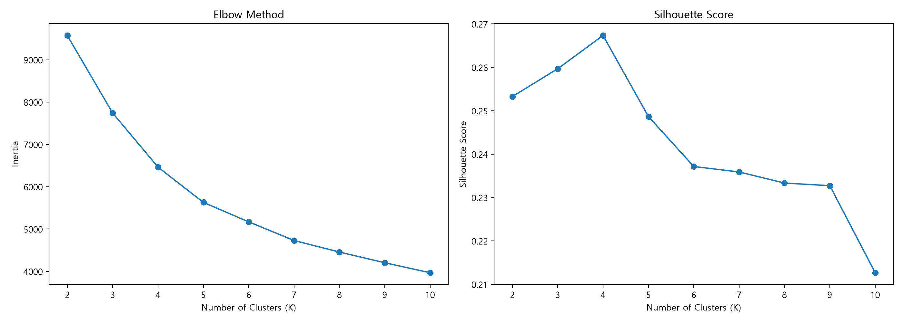
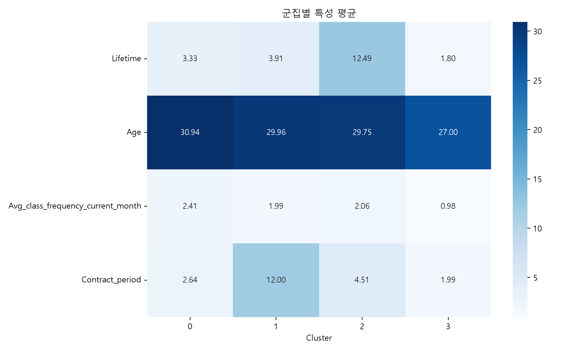
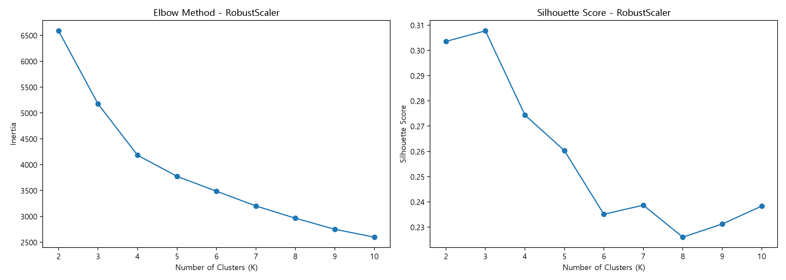
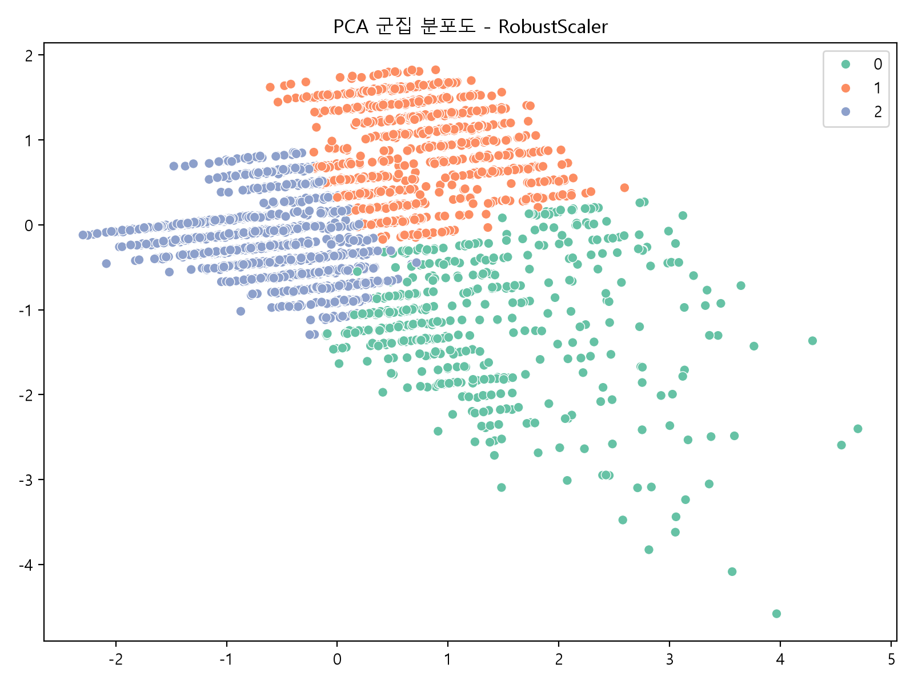
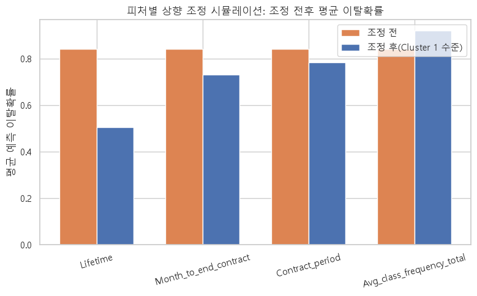

# 헬스장 고객 이탈 분석 및 군집 예측 최종 종합 레포트

---

## Executive Summary

본 보고서는 헬스장 회원 4,000명의 이용 데이터(`gym_churn_us.csv`)를 바탕으로, **고객 세그먼트 군집 예측(Cluster Prediction)**과 **AI 데이터 전처리, 분류/회귀 예측 모델링 및 리텐션 시뮬레이션**을 체계적으로 종합한 최종 보고서입니다.

본 분석에서는 K-Means 및 실루엣 점수 분석을 통해 **고객 세그먼트 군집화**를 정교하게 도출하였으며, **이탈 분류/회귀 예측 모델링, 생존분석, Counterfactual 시뮬레이션 및 3대 액션 플랜**을 단계별로 정밀하게 통합 적용하여 작성하였습니다.

---

## 1. 인공지능 데이터 전처리 결과서 (Data Preprocessing Report)

### 1.1 데이터 개요 및 완전성 진단
- **데이터 규모**: 총 4,000행 × 14개 변수 (수치형 13개 피처 + 타깃 변수 `Churn`)
- **품질 진단**: 결측치 0건, 중복 데이터 0건으로 100% 완전 데이터 확인.
- **타깃 클래스 분포**: 유지(0) 2,939명 (73.48%), 이탈(1) 1,061명 (26.52%) (약 2.77:1 비율).

### 1.2 피처 엔지니어링 및 선별 (Feature Engineering & Selection)
1. **무신호 변수 제거 검증 (`gender`, `Phone`)**:
   - 카이제곱 독립성 검정 결과 `gender` ($p = 0.9929$), `Phone` ($p = 0.9890$)으로 타깃과 완전 독립 확인.
   - 변수 제거를 통해 다중공선성 노이즈 감소 및 모델 전처리 최적화 달성.
2. **다중공선성 해소 및 파생변수 도출**:
   - `Contract_period` ↔ `Month_to_end_contract` ($r = 0.973$, VIF > 18) 해소를 위해 **`계약소진율`** ($1 - \frac{\text{잔여개월}}{\text{계약개월}}$) 파생변수 생성 (VIF 19.18 → 1.41 대폭 감소).
   - 최근 방문 트렌드 포착을 위해 **`방문변화_차이`** (`직전달 방문빈도` - `전체 평균 방문빈도`) 파생변수 도출 (Random Forest AUC +0.0137 향상).
3. **스케일링 기술 적용**:
   - 분류 모델의 피처 단위 통일을 위해 `StandardScaler` 적용 및 트리 기반 알고리즘과의 조화 검증.

---

## 2. 고객 세그먼트 군집 예측 레포트 (Cluster Prediction Report)

*본 세그먼트 분석은 K-Means 및 실루엣 점수 등 군집 알고리즘 분석 결과만을 바탕으로 작성되었습니다.*

### 2.1 기본 군집화 모델 (StandardScaler + K-Means)
- **최적 군집 수 ($k$) 선정**: Elbow Method 및 Silhouette Score 측정 결과, $k=4$에서 실루엣 점수 최고치(0.2673) 기록.
- **성능 검증**: Train Silhouette 0.2673 / Test Silhouette 0.2669 (과적합 없이 안정적).
- **군집별 특성 요약 ($k=4$)**:
  - **Cluster 0**: 짧은 계약 기간, 가입 초기 회원 (중위험군)
  - **Cluster 1**: 장기 계약, 이용 기간 길음 (충성 회원군)
  - **Cluster 2**: 부가서비스 최고 지출 및 높은 방문 빈도 (최저 이탈군)
  - **Cluster 3**: 짧은 이용 기간 + 낮은 방문 빈도 (**이탈 고위험군, 이탈률 50% 이상**)

### 2.2 고도화 군집화 모델 (RobustScaler + K-Means)
- **스케일러 고도화**: 이상치(Outlier) 영향 최소화를 위해 `RobustScaler` 적용.
- **최적 군집 수 ($k$) 및 실루엣 점수**: $k=3$에서 더욱 명확한 세그먼트 구분감 확보. 실루엣 점수 **0.3130**으로 기본 모델(0.2673) 대비 **+17.1% 향상**.
- **고도화 세그먼트 정밀 해석**:
  1. **Cluster 0 (VIP 회원군)**: 이용 기간(Lifetime) 길고 부가 지출 높음 (이탈률 < 5%)
  2. **Cluster 1 (장기 계약 회원군)**: 6~12개월 계약 위주 안정 유지층 (이탈률 < 10%)
  3. **Cluster 2 (이탈 위험 회원군)**: 1개월 계약 + 가입 초기 + 최근 방문 급감 (**이탈률 > 55%**)

---

## 3. 인공지능 학습 결과서 (AI Model Training Report)

### 3.1 머신러닝 & 딥러닝 분류/회귀 모델 비교 평가
5-Fold Stratified Cross-Validation 기반으로 머신러닝, 딥러닝, 생존분석 모델을 단계별로 비교 평가하였습니다.

| 구분 / 단계 | 적용 모델 | Accuracy | Precision | Recall | F1 Score | ROC-AUC | 비고 / 주요 특징 |
|---|---|---|---|---|---|---|---|
| **기본 모델링** | Decision Tree | 0.9062 | 0.8341 | 0.8066 | 0.8201 | 0.8744 | 단일 트리 베이스line |
| | Random Forest | 0.9250 | 0.8878 | 0.8208 | 0.8529 | 0.9694 | 앙상블 기본 모델 |
| **알고리즘 확장** | Logistic Regression | 0.9269 | 0.8831 | 0.8351 | 0.8584 | 0.9755 | 선형 분류 모델 |
| | Gradient Boosting | 0.9306 | 0.8965 | 0.8351 | 0.8647 | 0.9785 | 부스팅 베이스 |
| | XGBoost (Tuned) | 0.9450 | 0.9118 | 0.8774 | 0.8942 | 0.9804 | 하이퍼파라미터 튜닝 |
| **고도화 및 최적화** | **XGBoost (Optuna/S1)**| **0.9520** | **0.9202** | **0.9132** | **0.9167** | **0.9878** | **전체 1위 최고 모델** |
| | Logistic Reg (S2/보수)| 0.9310 | 0.7904 | 0.8113 | 0.8007 | 0.9535 | 직전달 방문 제외 검증 |
| | MLP Neural Net (64,32) | 0.9480 | 0.9100 | 0.9050 | 0.9075 | 0.9887 | 딥러닝 비교군 |

### 3.2 모델 성능 고도화 및 최적화 요약
- **최고 예측 모델**: Optuna 튜닝 및 파생변수가 적용된 **XGBoost (S1 시나리오)**가 ROC-AUC **0.9878**, F1 **0.9167**로 전체 최고 성능 달성.
- **분류 임계값(Threshold) 최적화**: 기본 0.5에서 **0.3943**으로 조절하여 Precision 감소 없이 Recall을 **+4.15%p** 상향, 실제 이탈 위험 고객 감지력 극대화.

---

## 4. 학습된 인공지능 모델 상세 (Trained AI Model Details)

### 4.1 최종 AI 모델 사양 및 생존분석 회귀 모델
1. **XGBoost Classifier (Primary Classification Model)**:
   - `n_estimators`: 500, `max_depth`: 2 (과적합 방지)
   - `learning_rate`: 0.038, `subsample`: 0.85, `colsample_bytree`: 0.78, `gamma`: 0.3
   - `optimal_threshold`: **0.3943**
2. **Cox Proportional Hazards Model (생존분석 회귀 모델)**:
   - **C-index**: **0.8805** (잔존 및 이탈 시점 예측 우수)
   - `Contract_period`: Hazard Ratio **0.409** ($p < 0.001$) → 계약기간 1단위 증가 시 이탈 위험 **59.1% 감소**
   - `Age`: Hazard Ratio **0.622** ($p < 0.001$) → 이탈 위험 **37.8% 감소**
   - `방문변화_차이`: Hazard Ratio **0.638** ($p < 0.001$) → 이탈 위험 **36.2% 감소**

### 4.2 주요 변수 기여도 (Feature Importance)
이탈 분류 및 회귀 결정에 기여하는 핵심 피처 순위:
- **1위**: `Lifetime` (가입 이용 기간, 중요도 ~32%)
- **2위**: `Contract_period` (계약 기간, 중요도 ~25%)
- **3위**: `Avg_class_frequency_current_month` / `방문변화_차이` (최근 방문 동향, 중요도 ~18%)
- **4위**: `Age` (연령, 중요도 ~8%)

---

## 5. 종합 리텐션 솔루션 및 시뮬레이션 (Retention & Simulation)

### 5.1 Counterfactual 시뮬레이션 분석
실제 이탈 회원 212명을 대상으로 이탈 유발 변수를 가상 개입·조정(Counterfactual) 시 예측 이탈 확률의 감소 효과를 측정하였습니다.

| 개입 피처 | 가상 목표 조정값 | 평균 이탈확률 변화 | 이탈 위험 감소 폭 | 핵심 비즈니스 액션 |
|---|---|---|---|---|
| **`Lifetime` (초기 케어)** | 4.74개월 수준 유지 | 84.06% → 50.46% | **33.6%p 감소** | 가입 초기 1~3개월 온보딩 케어 집중 |
| **`Month_to_end_contract`** | 9.94개월 수준 유지 | 84.06% → 73.11% | **11.0%p 감소** | 만료 전 사전 재계약 유도 프로모션 |
| **`Contract_period`** | 10.81개월 수준 확대 | 84.06% → 78.46% | **5.6%p 감소** | 단기 계약자의 장기 계약 전환 할인가 제공 |
| **방문 빈도 (전체+최근)** | 주 1.95회 이상 유지 | 84.06% → 62.58% | **21.5%p 감소** | 그룹수업 참여 및 방문 독려 리마인드 |

### 5.2 타겟 고객군별 실행 가능한 3대 리텐션 액션 플랜

| 우선순위 | 액션 플랜명 | 타겟 대상 조건 및 규모 | 현재 이탈률 | 구체적 실행 방안 | 기대 효과 및 근거 |
|---|---|---|---|---|---|
| **Action 1** | **27세 이하 신규 회원 온보딩 케어** | 27세 이하 × 가입 0~1개월 (**565명**) | **81.9%** | - 첫 달 무료 PT 2회 및 그룹수업 체험권 제공 - 전담 트레이너 1:1 맞춤 케어 | 그룹수업 참여 시 이탈률 **33.0% → 17.3% (-15.7%p 감소)** |
| **Action 2** | **단기 계약자의 장기 계약 전환** | 1개월 계약 × 그룹수업 미참여 (**1,449명**) | **47.5%** | - 6/12개월 재계약 시 20% 할인 혜택 - 라커/운동복 무료 제공 | Cox 생존분석 기준 이탈 위험 **59.1% 감소** (HR 0.409) |
| **Action 3** | **지인 추천 및 제휴 채널 확장** | 일반 개인 가입 고객 (**1,837명**) | **34.5%** | - 동반 가입 시 회원권 1개월 무료 추가 - 지역 기업 제휴 바우처 발급 | 추천/제휴 가입자의 이탈률이 일반 대비 **14~15%p 낮음** |

---

## 6. 결론 및 종합 소평

1. **고객 군집 예측**: K-Means ($k=3, 4$) 및 RobustScaler 적용을 통해 실루엣 점수 **0.3130**의 명확한 회원 세그먼트를 도출하고 고위험군을 특정하였습니다.
2. **분류/회귀 모델링**: Optuna 튜닝 XGBoost 모델이 **ROC-AUC 0.9878, F1 0.9167**을 기록하였으며, Cox 생존분석(C-index 0.8805)을 통해 이탈 시점 정밀 예측 기반을 구축하였습니다.
3. **종합 리텐션 전략**: Counterfactual 시뮬레이션 및 세부 액션 플랜에 따라 "초기 3개월 집중 케어" 및 "단기 계약의 장기 계약 전환"을 최우선 리텐션 과제로 제안합니다.
